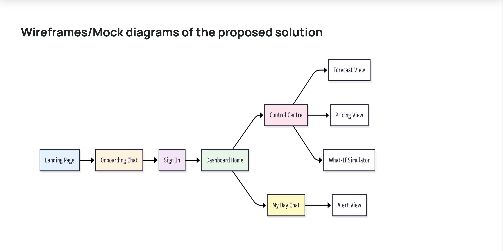
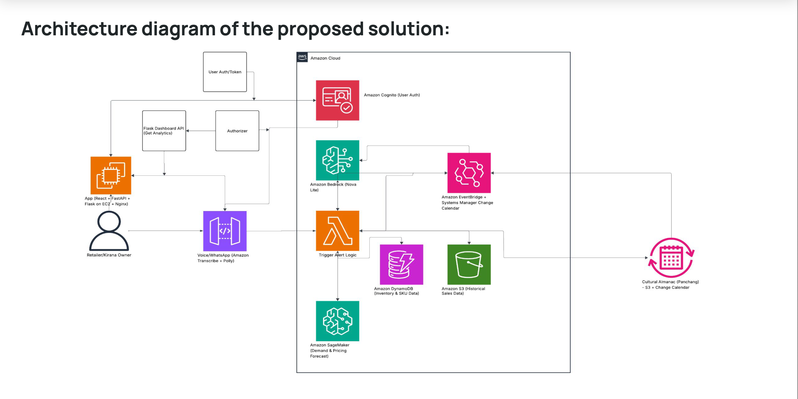
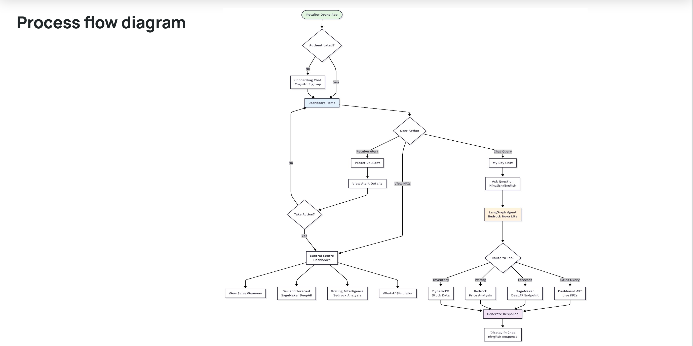
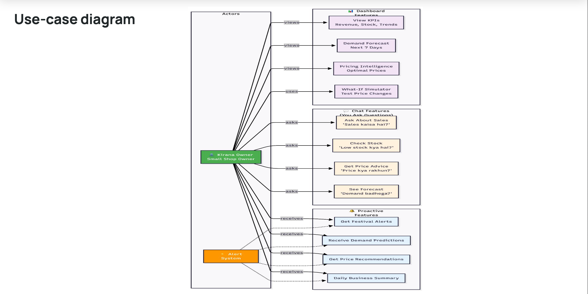
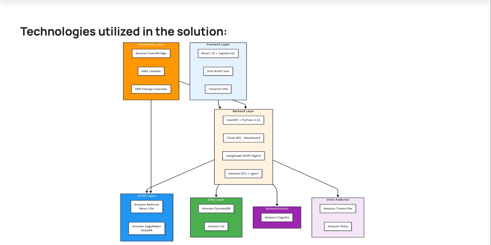

<div align="center">


# 🛒 AI Sahayak

### *Proactive Intelligence for Indian Kirana & MSMEs*

**AI Sahayak** is a hackathon project for **AWS AI for Bharat**: a proactive intelligence platform for small shopkeepers and MSMEs. It combines a **Control Centre** (KPIs, demand forecast, pricing, what-if) with **My Day** — a Hinglish chat where live alerts (festivals, news, daily summary) appear and where the user can set alert times (*"set alert for 2 pm"*). Five demo retailers (Raju, Ramesh, Suresh, Kanta, Lakshmi) are pre-seeded; sign in as any to see that persona’s dashboard and alerts.

> "Kal festival hai — demand badhega, stock aur price dono check kar lo."
>
> *AI Sahayak tells you what you need to know before you have to ask.*

[Features](#-features) · [Architecture](#-architecture) · [Tech Stack](#-tech-stack) · [Quick Start](#-quick-start) · [Project Structure](#-project-structure) · [Demo Users](#-demo-users)

### 🎬 Demo Video

[](https://drive.google.com/file/d/1ik-oeAu50V4CuQVZb5uEvjqQ32nhspJy/view?usp=sharing)

*Click the thumbnail to watch the full demo on Google Drive.*

### 📄 Project Deck (PPT) & Diagrams

**Project deck (submitted to AWS):** [**View Main PPT on GitHub**](diagrams/Main_PPT.pdf) — opens in GitHub’s viewer so you can scroll through the deck without leaving the repo.

</div>

---

#### Mock / Wireframe


#### Architecture


#### Process flow


#### Use case


#### Tech stack


---

## 🎯 The Problem

India has **63+ million MSMEs** — small shops, traders, small manufacturers, and service businesses. Most run on intuition and experience. They lack **demand forecasting**, **pricing intelligence**, and **early warnings** for festivals, compliance deadlines, supply disruptions, or price moves.

They lose out when they over-order before a price crash, under-stock before a demand spike, or miss a tax or compliance deadline.

---

## 💡 The Solution

**AI Sahayak** is a proactive intelligence platform that acts like a smart business partner for small business owners. It doesn’t wait for you to ask — it tells you what you need to know, when you need it, in **Hinglish** (Hindi + English mix).

The core idea: **Proactive > Reactive**. The system uses your calendar, business data, and relevant news to reach out to *you*.

```
AWS Change Calendar (events & deadlines)
         ↓
    EventBridge → Lambda (Alert Engine)
         ↓
   AI Sahayak Backend (FastAPI + LangGraph)
         ↓
    "My Day" Chat UI  /  WhatsApp
         ↓
    You get: "Demand spike expect karo, stock aur price check karo!"
```

---

## ✨ Features

### 🔔 My Day — Live Alerts Chat
Post-login proactive chat for the business owner. Real KPIs from the dashboard, Hinglish replies, and optional voice in/out (Amazon Polly + Transcribe). Lambda-pushed alerts for festivals, news, compliance, and daily forecasts show up here automatically.

### 📊 Control Centre — Dashboard
- **Demand Forecasting** — SageMaker DeepAR when configured; fallback to Prophet ensemble
- **Pricing Intelligence** — Price elasticity, margin calculator, competitor-aware suggestions
- **What-If Simulator** — "Agar main price 10% badha doon toh kya hoga?" with a slider
- **KPIs** — Revenue, stock alerts, top items, trend charts (Recharts)

### 🤖 Proactive Pipeline (The "Wow" Factor)
- **Event calendar** via AWS Systems Manager Change Calendar — festivals, deadlines, seasonal events
- **EventBridge** triggers the alert Lambda on a schedule (e.g. every 30 minutes so per-user times like "2 pm" work)
- **Per-user alert time:** In My Day chat, say *"set alert for 2 pm"* or *"8 baje bhejo"* — stored in DynamoDB (`ai-sahayak-users`), Lambda sends alerts only at that hour
- Lambda merges: national + regional calendar (from S3) + MSME-relevant RSS news (GST, commodity prices, small biz)
- Generates personalized Hinglish alerts per user → posts to backend webhook → shows in My Day chat

### 💬 Reactive Chat — "Sahayak"
Ask anything in Hinglish:
- *"Sales kaisa hai?"* → KPI summary
- *"Low stock kaunsa hai?"* → Items below threshold
- *"Sahi price kya rakhna chahiye?"* → AI pricing suggestion
- *"Aane wale din mein demand kahan badhega?"* → Demand forecast

Powered by **LangGraph** multi-agent workflows with **Amazon Bedrock (Nova Lite)**.

### 📱 WhatsApp Integration (Optional)
Same Hinglish chat and proactive alerts on WhatsApp — the channel most small business owners already use.

---

## 🏗 Architecture


---

## 🛠 Tech Stack


| Layer | Technology |
|---|---|
| **Frontend** | React, TypeScript, Vite, Tailwind CSS, Lucide React |
| **Auth** | Amazon Cognito (User Pools) |
| **Agents Backend** | FastAPI, LangGraph, Python 3.11 |
| **AI / LLM** | Amazon Bedrock — Nova Lite (chat + reasoning) |
| **Forecasting** | SageMaker DeepAR + Prophet ensemble fallback |
| **Proactive Engine** | AWS Lambda (Python), EventBridge, SSM Change Calendar |
| **Data** | DynamoDB (`ai-sahayak-users` = 5 demo retailers + alert prefs; `ai_sahayak_user_info` = onboarding users), MongoDB (conversation memory), S3 (calendar) |
| **Voice** | Amazon Transcribe (speech → text), Amazon Polly (text → speech) |
| **WhatsApp** | Meta WhatsApp Business API |
| **Translation** | Bhashini API (optional multi-lingual) |
| **Dashboard** | Flask (API), React (Control Centre UI), Recharts |
| **Infra-as-Code** | Terraform (EventBridge, Lambda, S3, IAM) |
| **Deployment** | AWS EC2 (systemd services via `start.sh`) |

---

## ⚡ Quick Start

### Prerequisites
- Node.js 18+, Python 3.11+
- AWS account with Bedrock access (ap-south-1 region)
- MongoDB (local or Atlas)

### 1. Clone
```bash
git clone https://github.com/Sid3503/ai-sahayak.git
cd ai-sahayak
```

### 2. Set up environment files
```bash
# Agents backend
cp app/backend/agents/.env.example app/backend/agents/.env

# Dashboard
cp app/Dashboard/.env.example app/Dashboard/.env

# Frontend
cp app/frontend/.env.example app/frontend/.env
```

Fill in your AWS credentials and MongoDB URI in each `.env` file. Minimum required:
```env
# app/backend/agents/.env
AWS_ACCESS_KEY_ID=your_key
AWS_SECRET_ACCESS_KEY=your_secret
BEDROCK_REGION=ap-south-1
MONGODB_URI=mongodb://localhost:27017
COGNITO_USER_POOL_ID=your_pool_id
# So chat-set alert times (e.g. "set alert for 2 pm") write to same table Lambda reads:
ALERT_USERS_TABLE=ai-sahayak-users
```

### 3. Run all 4 services with one command
```bash
./start.sh
```

This starts:
| Service | Port | What it is |
|---|---|---|
| Agents Backend | `8000` | FastAPI + LangGraph |
| Dashboard API | `8001` | Flask + Bedrock/SageMaker |
| Frontend | `5173` | React (main app) |
| Dashboard UI | `5174` | React (Control Centre) |

### 4. Open the app
```
http://localhost:5173
```

Go through **Onboarding → Sign in (e.g. as Raju) → Dashboard → My Day** for the full experience.

---

## 🧪 Test the Proactive Pipeline Locally

With all services running:
```bash
cd app/backend/agents
python scripts/test_alerts_incoming.py
```

Open **My Day**, select a demo user — the test alert appears in chat within ~30 seconds.

---

## 🗂 Project Structure

```
ai-sahayak/
├── start.sh                          # One command: run all 4 services
├── PROJECT.md                        # Project overview, env files, run instructions
│
├── app/
│   ├── frontend/                     # Main React app (landing, onboarding, My Day)
│   │   └── src/
│   │
│   ├── backend/
│   │   ├── agents/                   # FastAPI + LangGraph multi-agent system
│   │   │   └── src/ai_sahayak/
│   │   │       ├── api/routes/       # chat, alerts, tts, profile, webhooks
│   │   │       ├── graphs/           # LangGraph workflows (sales, pricing, forecast…)
│   │   │       ├── tools/            # Bedrock, SageMaker, DynamoDB, Dashboard tools
│   │   │       ├── channels/         # WhatsApp formatter + outbound
│   │   │       ├── language/         # Bhashini translation pipeline
│   │   │       ├── memory/           # MongoDB conversation + profile store
│   │   │       └── vision/           # Shelf image analysis (Bedrock Vision)
│   │   │
│   │   └── lambda/
│   │       └── alerts_handler.py     # Daily alert Lambda (calendar + RSS → webhook)
│   │
│   └── Dashboard/                    # Control Centre (Flask API + React UI)
│
├── infra/                            # Terraform: EventBridge, Lambda, S3, IAM
│   ├── main.tf
│   ├── eventbridge.tf
│   ├── lambda.tf
│   └── s3.tf
│
└── deploy/
    └── ec2-setup.sh                  # EC2 bootstrap script
```

---

## 👥 Demo Users

The system ships with **5 pre-built retailer personas** in DynamoDB table `ai-sahayak-users`. Each has a city/state, and alert time can be set from **My Day** chat (e.g. *"set alert for 2 pm"*). Lambda uses these to send proactive alerts to the right user.

| User ID | Display Name | City | State |
|---------|--------------|------|-------|
| `raju` | Raju Bhai | Indore | MP |
| `ramesh` | Ramesh Bhai | Bhopal | MP |
| `suresh` | Suresh Bhai | Jaipur | RJ |
| `kanta` | Kanta Didi | Surat | GJ |
| `lakshmi` | Lakshmi Didi | Hyderabad | TS |

Sign in with any of these (Cognito credentials as set in your pool). **My Day** and the Control Centre iframe are scoped to the signed-in retailer (e.g. `?retailer=raju`).

---

## 🔑 AWS Services Used

| Service | Usage |
|---|---|
| **Amazon Bedrock** (Nova Lite) | Chat reasoning, Hinglish responses, pricing explanations |
| **Amazon SageMaker** (DeepAR) | Per-user demand forecasting model endpoints |
| **AWS Lambda** | Proactive alert handler, event orchestrator |
| **Amazon EventBridge** | Scheduled trigger for alert Lambda (e.g. every 30 min for per-user alert times) |
| **AWS Systems Manager** (Change Calendar) | Event calendar — festivals, deadlines, seasonal events |
| **Amazon DynamoDB** | `ai-sahayak-users`: 5 demo retailers + alert_time_hour_ist / alert_time_minute_ist (set via chat). Alert store in backend. |
| **Amazon S3** | National + regional calendars (JSON) |
| **Amazon Cognito** | User authentication (same pool for frontend + chat onboarding) |
| **Amazon Transcribe** | Voice message → text (onboarding + My Day) |
| **Amazon Polly** | Text → voice (Hinglish TTS in My Day) |

---

## 🌟 What Makes It "Proactive"

Most AI tools are **reactive** — you ask, they answer.

AI Sahayak is **proactive** — it tells you what you need to know before you have to ask:

```
On schedule (e.g. every 30 min or daily 9 AM IST):
  EventBridge fires
      ↓
  Lambda checks SSM Change Calendar (events & deadlines)
      ↓
  "Festival / deadline in 3 days" → fetch demand & news context
      ↓
  "Demand spike expected; commodity price move in news"
      ↓
  Cross-check current stock / business data from DynamoDB
      ↓
  "Stock low for high-demand items; price update recommended"
      ↓
  Hinglish alert: POST → backend webhook → My Day chat
      ↓
  You open the app and see: "Kal order kar do / price adjust karo!"
```

This proactive loop — **Calendar → Context → Business Data → Alert** — is the core differentiator.

---

## 🏆 Built For

**AWS AI for Bharat Hackathon** — Building AI solutions for India's grassroots economy.

Target users: **63+ million MSMEs** across Bharat — small retail, traders, small manufacturers, and service businesses — who deserve the same intelligence as larger enterprises, delivered in their language, on their phone.

---

<div align="center">

Made with ❤️ for Bharat's MSMEs

*"Har chhota business ka apna Sahayak"*

</div>
