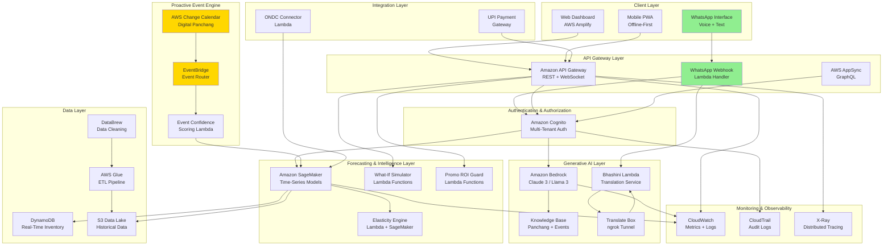
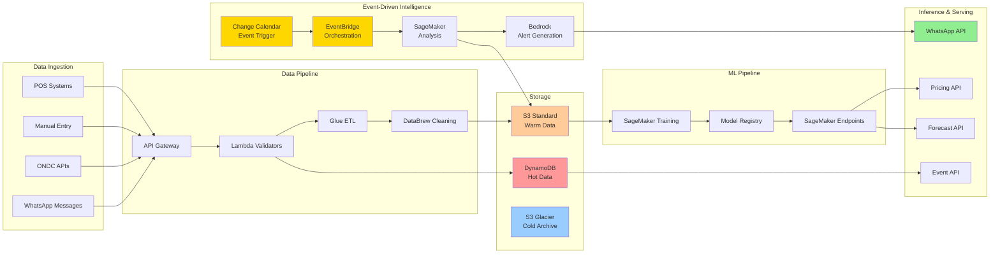
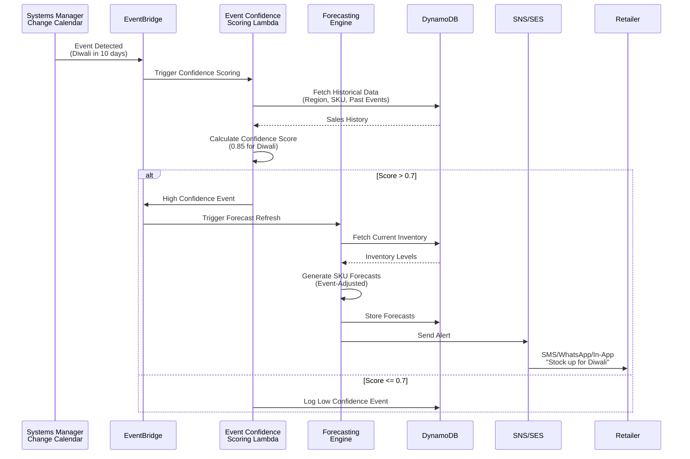
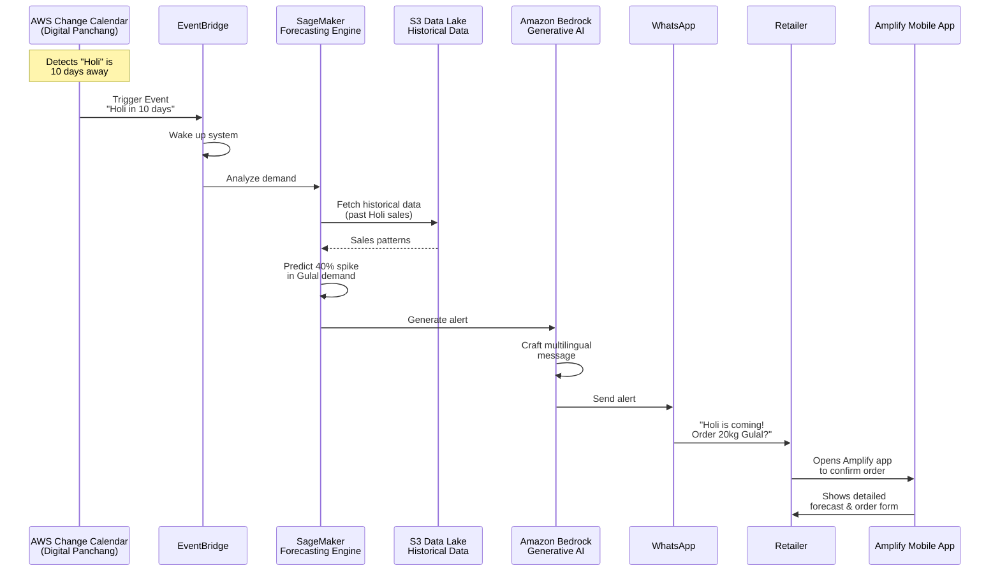
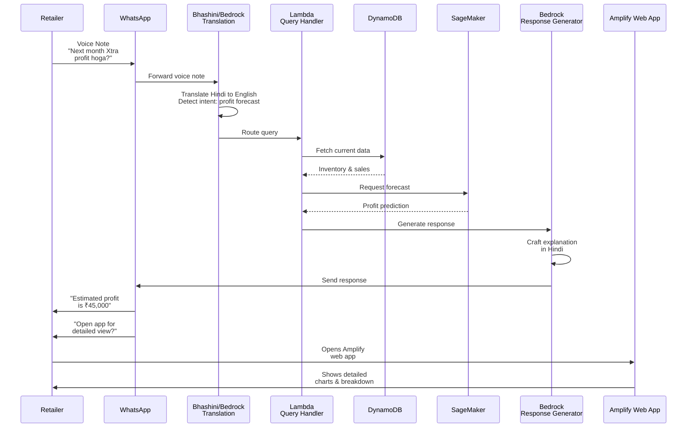
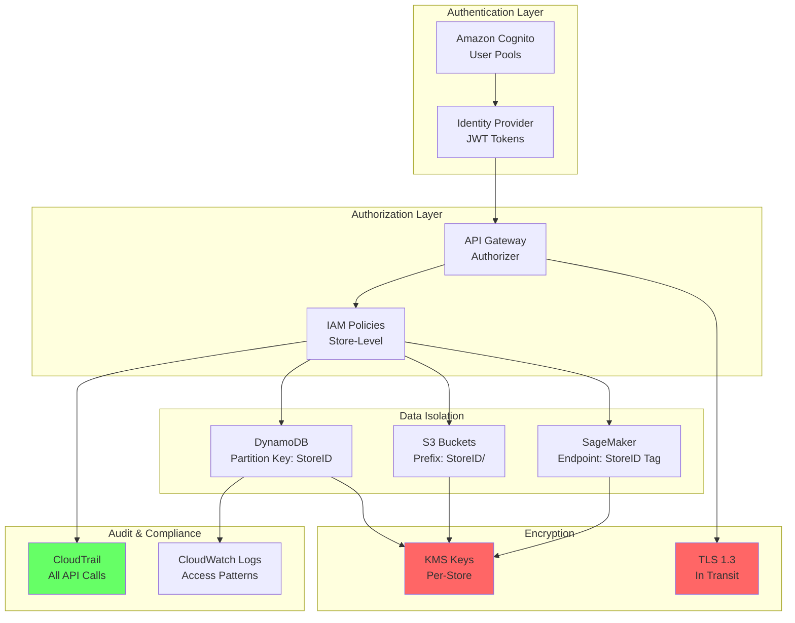

# Design Document: AI Sahayak

## Overview

AI Sahayak is a cloud-native, serverless AI-Powered Retail Intelligence platform built on AWS infrastructure. The system empowers Bharat MSMEs with proactive demand forecasting, pricing intelligence, and inventory optimization by leveraging cultural events, festivals, and regional life-events specific to India.

The platform operates through two primary interaction modes:

1. **Scenario A: Proactive Alerts (AI-Initiated)**: The system automatically detects upcoming events through AWS Change Calendar (Digital Panchang), analyzes historical data via SageMaker, and proactively sends multilingual alerts through WhatsApp, SMS, and in-app notifications with specific recommendations (e.g., "Holi is coming! Order 20kg Gulal?").

2. **Scenario B: Reactive Queries (User-Initiated)**: Retailers can ask business questions via WhatsApp voice notes or text (e.g., "Next month Xtra profit hoga?"), which are translated by Bhashini, analyzed by Lambda and SageMaker, and answered conversationally by Bedrock with options to view detailed analysis in the Amplify app.

The platform combines generative AI for multilingual conversational assistance, machine learning for predictive analytics, and event-driven architecture for proactive alerting. It is designed to work reliably on low-bandwidth networks (2G/3G), support offline operation, and scale to 10,000+ concurrent retailers while maintaining sub-3-second response times.

### Key Design Principles

1. **Proactive Intelligence**: Event-driven architecture that anticipates retailer needs before they arise
2. **Conversational Interface**: WhatsApp as a primary channel for both AI-initiated alerts and user-initiated queries
3. **Hyper-Local Context**: Region, culture, and pin code-specific insights
4. **Accessibility First**: Multilingual voice interface, low-bandwidth support, offline-first design
5. **Explainable AI**: Transparent, understandable recommendations for non-technical users
6. **Micro-Economics**: Pay-per-event pricing aligned with MSME cash flow patterns
7. **Privacy by Design**: Store-level data isolation with encryption and compliance
8. **Serverless Scalability**: Auto-scaling AWS services for cost-efficient growth

## Architecture

### High-Level Architecture



### Data Flow Architecture



### Proactive Alert Data Flow (Scenario A)

```
Change Calendar → EventBridge → SageMaker → S3 Historical Data
                                    ↓
                              Demand Prediction
                                    ↓
                              Bedrock (Alert Crafting)
                                    ↓
                    WhatsApp / SMS / In-App Notification
                                    ↓
                              User Confirmation
                                    ↓
                            Amplify App (Details)
```

### Reactive Query Data Flow (Scenario B)

```
WhatsApp Voice/Text → Bhashini (Translation) → Lambda (Intent Detection)
                                                      ↓
                                        DynamoDB + SageMaker (Analysis)
                                                      ↓
                                            Bedrock (Response Generation)
                                                      ↓
                                              WhatsApp Response
                                                      ↓
                                        Amplify App (Detailed View)
```

### Event-Driven Forecast Trigger Flow



### Scenario A: Proactive Alert (AI-Initiated)

This scenario demonstrates the system's proactive intelligence, where AI detects an upcoming event and initiates the alert workflow.



### Scenario B: Reactive Query (User-Initiated)

This scenario demonstrates user-initiated queries where the retailer asks questions and receives intelligent responses.



### Multi-Tenant Security Architecture



## Components and Interfaces

### 0. WhatsApp Integration Layer

**Purpose**: Provide WhatsApp as a primary interface channel for both proactive alerts and reactive queries, enabling conversational interaction with the AI system.

**Components**:

- **WhatsApp Business API**: Official WhatsApp Business API for sending and receiving messages
- **Webhook Handler**: Lambda function that processes incoming WhatsApp messages and voice notes
- **Message Router**: Routes messages to appropriate handlers based on message type and intent
- **Session Manager**: Maintains conversation context for follow-up questions (30-minute sessions)
- **Deep Link Generator**: Creates links to Amplify app for detailed views

**Interfaces**:

```typescript
interface WhatsAppIntegrationService {
  // Send message via WhatsApp
  sendMessage(recipient: string, message: WhatsAppOutboundMessage): Promise<void>;
  
  // Handle incoming webhook from WhatsApp
  handleWebhook(event: WhatsAppWebhookEvent): Promise<void>;
  
  // Process voice note
  processVoiceNote(audioData: Buffer, from: string): Promise<void>;
  
  // Generate deep link to Amplify app
  generateDeepLink(storeId: string, view: string, params?: any): string;
}

interface WhatsAppOutboundMessage {
  type: 'text' | 'template' | 'interactive';
  content: string;
  buttons?: WhatsAppButton[];
  language?: SupportedLanguage;
}

interface WhatsAppButton {
  id: string;
  title: string;
  type: 'quick_reply' | 'url';
  url?: string;
}

interface WhatsAppWebhookEvent {
  from: string; // Phone number
  messageId: string;
  timestamp: Date;
  type: 'text' | 'voice' | 'button_reply';
  content: string | Buffer;
  buttonId?: string;
}
```

**Message Flow Examples**:

**Proactive Alert (Scenario A)**:
```typescript
// System sends proactive alert
await whatsappService.sendMessage('+919876543210', {
  type: 'interactive',
  content: 'Holi is coming in 10 days! Based on last year, you sold 18kg of Gulal.',
  buttons: [
    { id: 'order_20kg', title: 'Order 20kg Gulal', type: 'quick_reply' },
    { id: 'view_details', title: 'View Details', type: 'url', 
      url: 'https://app.aisahayak.com/forecast/holi' }
  ],
  language: 'hi'
});
```

**Reactive Query (Scenario B)**:
```typescript
// User sends voice note: "Next month Xtra profit hoga?"
// System processes and responds
await whatsappService.sendMessage('+919876543210', {
  type: 'text',
  content: 'अगले महीने का अनुमानित लाभ ₹45,000 है। यह पिछले महीने से 12% अधिक है।',
  buttons: [
    { id: 'view_breakdown', title: 'विस्तृत विवरण देखें', type: 'url',
      url: 'https://app.aisahayak.com/profit-forecast' }
  ],
  language: 'hi'
});
```

**Key Design Decisions**:

1. Use WhatsApp Business API for official, reliable messaging
2. Support both text and voice input for accessibility
3. Maintain 30-minute conversation sessions for context
4. Provide quick reply buttons for common actions
5. Include deep links to Amplify app for detailed analysis
6. Handle webhook events asynchronously via Lambda
7. Implement rate limiting to comply with WhatsApp policies
8. Store conversation history in DynamoDB for context and analytics

### 1. Generative AI Layer

**Purpose**: Provide multilingual conversational AI assistance for retailers to query insights, get recommendations, and interact naturally with the system through multiple channels including WhatsApp.

**Components**:

- **Amazon Bedrock Integration**: Hosts Claude 3 or Llama 3 foundation models
- **Knowledge Base for Bedrock**: Vector database containing Panchang data, festival information, cultural events, and retail best practices
- **Bhashini Translation Service**: AWS Lambda function that integrates with Bhashini API for Indian language translation (both text and voice)
- **Translate Box (ngrok)**: Tunneling service that enables secure communication between AWS Lambda and Bhashini external APIs
- **Conversation Manager**: Lambda function that maintains conversation context and routes queries
- **WhatsApp Integration**: Lambda webhook handler for processing WhatsApp messages and voice notes
- **Intent Detector**: Analyzes user queries to determine intent (profit forecast, inventory check, pricing advice, etc.)

**Interfaces**:

```typescript
interface ConversationalAIService {
  // Process user query in any supported language
  processQuery(request: QueryRequest): Promise<QueryResponse>;
  
  // Translate text between languages
  translate(text: string, sourceLang: string, targetLang: string): Promise<string>;
  
  // Transcribe and translate voice notes
  processVoiceNote(audioData: Buffer, sourceLang: string): Promise<string>;
  
  // Query knowledge base for context
  queryKnowledgeBase(query: string, filters: KBFilters): Promise<KBResult[]>;
  
  // Handle WhatsApp webhook events
  handleWhatsAppMessage(message: WhatsAppMessage): Promise<void>;
}

interface QueryRequest {
  userId: string;
  storeId: string;
  query: string;
  language: SupportedLanguage;
  conversationId?: string;
  voiceInput?: boolean;
  channel: 'whatsapp' | 'web' | 'mobile';
}

interface QueryResponse {
  response: string;
  language: SupportedLanguage;
  confidence: number;
  sources: string[];
  suggestedActions?: Action[];
  processingTimeMs: number;
  deepLinkToApp?: string; // Link to Amplify app for detailed view
}

interface WhatsAppMessage {
  from: string; // Phone number
  messageId: string;
  type: 'text' | 'voice' | 'image';
  content: string | Buffer;
  timestamp: Date;
}

type SupportedLanguage = 
  | 'hi' | 'ta' | 'te' | 'bn' | 'mr' 
  | 'gu' | 'kn' | 'ml' | 'pa' | 'en';
```

**Key Design Decisions**:

1. Use Amazon Bedrock instead of self-hosted models for automatic scaling and model updates
2. Implement caching layer for common queries to reduce latency and costs
3. Use streaming responses for voice interactions to minimize perceived latency
4. Implement fallback to simpler models when Bedrock is unavailable
5. Use ngrok or similar tunneling for Bhashini API access from Lambda
6. Maintain conversation context for 30 minutes to support follow-up questions
7. Provide deep links to Amplify app for detailed analysis after WhatsApp responses
8. Support both proactive alerts (AI-initiated) and reactive queries (user-initiated) through the same interface

### 2. Life-Event Detection Engine

**Purpose**: Automatically detect upcoming cultural events, festivals, and regional life-events that impact retail demand, using AWS Change Calendar as the primary trigger for proactive alerts.

**Components**:

- **AWS Change Calendar (Digital Panchang)**: Primary event source containing Indian calendar events, festivals, and cultural occasions
- **Event Detector**: Lambda function triggered by EventBridge when Change Calendar detects upcoming events
- **Regional Event Mapper**: Maps events to geographic regions and cultural zones
- **Event Confidence Scorer**: Calculates likelihood and impact of events based on historical data
- **Alert Orchestrator**: Coordinates the flow from event detection → analysis → alert generation → delivery

**Interfaces**:

```typescript
interface EventDetectionService {
  // Detect upcoming events for a region (triggered by Change Calendar)
  detectEvents(region: RegionContext, daysAhead: number): Promise<Event[]>;
  
  // Calculate confidence score for an event
  calculateConfidence(event: Event, context: StoreContext): Promise<ConfidenceScore>;
  
  // Get event impact on specific SKU categories
  getEventImpact(event: Event, categories: string[]): Promise<EventImpact[]>;
  
  // Orchestrate proactive alert workflow (Scenario A)
  orchestrateProactiveAlert(event: Event): Promise<AlertResult>;
}

interface Event {
  id: string;
  name: string;
  type: EventType;
  date: Date;
  duration: number; // days
  regions: string[]; // pin codes, districts, states
  culturalSignificance: number; // 0-1
  historicalImpact: number; // 0-1
  daysUntilEvent: number;
}

interface ConfidenceScore {
  score: number; // 0-1
  factors: {
    historicalSales: number;
    regionalDemographics: number;
    eventSignificance: number;
    seasonality: number;
  };
  explanation: string;
}

interface AlertResult {
  eventId: string;
  storesAlerted: number;
  alertsSent: {
    whatsapp: number;
    sms: number;
    inApp: number;
  };
  averageConfidenceScore: number;
}

interface RegionContext {
  pinCode: string;
  district: string;
  state: string;
  culturalZone: string;
}

type EventType = 
  | 'festival' | 'harvest' | 'wedding_season' 
  | 'school_term' | 'weather' | 'government_scheme';
```

**Proactive Alert Workflow (Scenario A)**:

1. **Event Detection**: AWS Change Calendar detects "Holi is 10 days away"
2. **EventBridge Trigger**: Wakes up the Event Detector Lambda
3. **Confidence Scoring**: Analyzes historical data to calculate Event_Confidence_Score
4. **Forecast Analysis**: If score > 0.7, triggers SageMaker to analyze S3 data and predict demand spike (e.g., 40% increase in Gulal)
5. **Alert Generation**: Bedrock crafts multilingual alert with specific recommendations
6. **Multi-Channel Delivery**: Sends alert via WhatsApp, SMS, and in-app notifications
7. **User Action**: User can respond via WhatsApp or open Amplify app for detailed view

**Key Design Decisions**:

1. Use AWS Change Calendar as the authoritative source for event triggers (not polling)
2. EventBridge provides event-driven architecture for immediate response
3. Calculate confidence scores using historical sales correlation with past events
4. Support hyper-local event detection at pin code level
5. Implement event hierarchy (national > state > district > local)
6. Provide specific, actionable recommendations in alerts (e.g., "Order 20kg Gulal" not just "Holi is coming")
7. Enable two-way communication via WhatsApp for order confirmations

### 3. Hyper-Local SKU Forecasting Engine

**Purpose**: Generate accurate demand predictions for each SKU at store level, incorporating event intelligence and historical patterns.

**Components**:

- **SageMaker Training Pipeline**: Trains time-series models on historical sales data
- **Forecast Generator**: Lambda function that generates predictions using trained models
- **Event Integration Layer**: Incorporates event confidence scores into forecasts
- **Accuracy Tracker**: Monitors and reports forecast accuracy metrics

**Interfaces**:

```typescript
interface ForecastingService {
  // Generate demand forecast for SKUs
  generateForecast(request: ForecastRequest): Promise<Forecast[]>;
  
  // Get forecast accuracy metrics
  getAccuracyMetrics(storeId: string, period: DateRange): Promise<AccuracyMetrics>;
  
  // Trigger immediate forecast refresh
  refreshForecast(storeId: string, reason: string): Promise<void>;
}

interface ForecastRequest {
  storeId: string;
  skus: string[];
  horizons: number[]; // [7, 14, 30] days
  includeEvents: boolean;
  includeConfidenceIntervals: boolean;
}

interface Forecast {
  sku: string;
  horizon: number;
  predictions: DailyPrediction[];
  confidenceInterval: {
    lower: number[];
    upper: number[];
  };
  accuracy: {
    mape: number; // Mean Absolute Percentage Error
    rmse: number; // Root Mean Square Error
  };
  influencingFactors: Factor[];
  generatedAt: Date;
}

interface DailyPrediction {
  date: Date;
  predictedDemand: number;
  eventImpact?: number;
  seasonalityFactor: number;
}

interface Factor {
  name: string;
  impact: number; // -1 to 1
  explanation: string;
}
```

**Key Design Decisions**:

1. Use SageMaker DeepAR or Prophet for time-series forecasting
2. Implement hierarchical forecasting (category → SKU) for cold-start items
3. Update forecasts daily at 2 AM IST, with event-triggered refreshes
4. Provide multiple forecast horizons (7, 14, 30 days) for different planning needs
5. Include confidence intervals to communicate uncertainty

### 4. Elasticity-Aware Pricing Engine

**Purpose**: Analyze price sensitivity and simulate demand impact of pricing changes to optimize revenue.

**Components**:

- **Elasticity Calculator**: Computes price elasticity coefficients from historical data
- **Demand Simulator**: Simulates demand at different price points
- **Revenue Optimizer**: Suggests optimal prices for revenue maximization
- **Competitive Intelligence**: Integrates ONDC pricing data

**Interfaces**:

```typescript
interface PricingIntelligenceService {
  // Calculate price elasticity for SKUs
  calculateElasticity(storeId: string, skus: string[]): Promise<ElasticityCoefficient[]>;
  
  // Simulate demand at different prices
  simulatePricing(request: PricingSimulation): Promise<SimulationResult>;
  
  // Get pricing recommendations
  recommendPricing(storeId: string, skus: string[], objective: PricingObjective): Promise<PricingRecommendation[]>;
}

interface ElasticityCoefficient {
  sku: string;
  coefficient: number; // % demand change per % price change
  confidence: number;
  dataPoints: number;
  lastUpdated: Date;
}

interface PricingSimulation {
  storeId: string;
  sku: string;
  currentPrice: number;
  priceRange: {
    min: number;
    max: number;
    step: number;
  };
  forecastHorizon: number;
}

interface SimulationResult {
  sku: string;
  scenarios: PriceScenario[];
  optimalPrice: number;
  currentRevenue: number;
  optimalRevenue: number;
  revenueUplift: number;
}

interface PriceScenario {
  price: number;
  predictedDemand: number;
  revenue: number;
  profit: number;
  margin: number;
}

type PricingObjective = 'maximize_revenue' | 'maximize_profit' | 'maximize_volume' | 'match_competition';
```

**Key Design Decisions**:

1. Calculate elasticity using regression on historical price-demand data
2. Use category-level elasticity as fallback for SKUs with insufficient data
3. Simulate ±30% price range to cover realistic pricing scenarios
4. Update elasticity coefficients monthly to capture changing market dynamics
5. Integrate ONDC competitive pricing data for market context

### 5. What-If Simulation Lab

**Purpose**: Enable retailers to test different business scenarios before implementation.

**Components**:

- **Scenario Manager**: Manages multiple concurrent simulation scenarios
- **Impact Calculator**: Computes deterministic outcomes for scenarios
- **Comparison Engine**: Provides side-by-side scenario comparisons
- **Explanation Generator**: Creates human-readable summaries

**Interfaces**:

```typescript
interface SimulationLabService {
  // Create a new simulation scenario
  createScenario(request: ScenarioRequest): Promise<Scenario>;
  
  // Run simulation and get results
  runSimulation(scenarioId: string): Promise<SimulationOutcome>;
  
  // Compare multiple scenarios
  compareScenarios(scenarioIds: string[]): Promise<ScenarioComparison>;
}

interface ScenarioRequest {
  storeId: string;
  name: string;
  type: ScenarioType;
  parameters: ScenarioParameters;
}

type ScenarioType = 'pricing' | 'inventory' | 'promotion' | 'combined';

interface ScenarioParameters {
  priceChanges?: Map<string, number>; // SKU -> new price
  inventoryLevels?: Map<string, number>; // SKU -> quantity
  promotions?: Promotion[];
  duration: number; // days
}

interface SimulationOutcome {
  scenarioId: string;
  metrics: {
    revenue: number;
    profit: number;
    volume: number;
    stockoutProbability: number;
    holdingCosts: number;
  };
  dailyProjections: DailyMetrics[];
  risks: Risk[];
  explanation: string;
}

interface ScenarioComparison {
  scenarios: SimulationOutcome[];
  winner: string; // scenario ID
  winningMetric: string;
  recommendations: string[];
}
```

**Key Design Decisions**:

1. Support up to 5 concurrent scenarios to prevent analysis paralysis
2. Use deterministic calculations based on elasticity and forecast models
3. Provide explainable summaries highlighting key drivers
4. Allow saving and sharing scenarios for team collaboration

### 6. Promo ROI Guard

**Purpose**: Validate promotional campaigns for profitability before launch.

**Components**:

- **ROI Calculator**: Computes expected return on promotional investment
- **Cannibalization Analyzer**: Estimates impact on non-promoted SKUs
- **Cost Aggregator**: Factors in all costs (supplier, operational, marketing)
- **Alert Generator**: Warns about unprofitable promotions

**Interfaces**:

```typescript
interface PromoROIService {
  // Validate a promotional campaign
  validatePromo(promo: PromotionProposal): Promise<PromoValidation>;
  
  // Calculate expected ROI
  calculateROI(promo: PromotionProposal): Promise<ROIAnalysis>;
  
  // Suggest alternative parameters
  optimizePromo(promo: PromotionProposal): Promise<PromotionProposal>;
}

interface PromotionProposal {
  storeId: string;
  name: string;
  skus: string[];
  discountPercent: number;
  startDate: Date;
  endDate: Date;
  marketingCost: number;
  expectedDemandLift: number; // % increase
}

interface PromoValidation {
  isViable: boolean;
  expectedROI: number;
  breakEvenVolume: number;
  risks: string[];
  recommendations: string[];
}

interface ROIAnalysis {
  totalRevenue: number;
  totalCosts: {
    supplierCosts: number;
    discountCosts: number;
    marketingCosts: number;
    operationalCosts: number;
  };
  netProfit: number;
  roi: number; // %
  cannibalizationImpact: number;
  paybackPeriod: number; // days
}
```

**Key Design Decisions**:

1. Calculate ROI considering all cost components (not just discount)
2. Model cannibalization using category affinity and substitution patterns
3. Alert when ROI is negative or below configurable threshold
4. Suggest alternative parameters (discount depth, duration) for better ROI
5. Schedule EventBridge alerts for campaign start/end dates

### 7. ONDC Market Intelligence Layer

**Purpose**: Provide competitive intelligence from ONDC marketplace data.

**Components**:

- **ONDC Connector**: Lambda function integrating with ONDC APIs
- **Price Aggregator**: Collects and anonymizes competitive pricing
- **Trend Analyzer**: Identifies market trends and demand patterns
- **Privacy Filter**: Ensures individual seller privacy

**Interfaces**:

```typescript
interface ONDCIntelligenceService {
  // Fetch competitive pricing for SKUs
  getCompetitivePricing(region: string, skus: string[]): Promise<CompetitivePricing[]>;
  
  // Get market trends
  getMarketTrends(region: string, category: string): Promise<MarketTrend>;
  
  // Refresh ONDC data
  refreshData(): Promise<void>;
}

interface CompetitivePricing {
  sku: string;
  region: string;
  priceRange: {
    min: number;
    max: number;
    median: number;
    percentile25: number;
    percentile75: number;
  };
  sampleSize: number;
  lastUpdated: Date;
}

interface MarketTrend {
  category: string;
  region: string;
  demandTrend: 'increasing' | 'stable' | 'decreasing';
  priceTrend: 'increasing' | 'stable' | 'decreasing';
  topSKUs: string[];
  insights: string[];
}
```

**Key Design Decisions**:

1. Refresh ONDC data daily to balance freshness with API costs
2. Anonymize and aggregate data to protect individual seller privacy
3. Use regional filtering to provide relevant competitive context
4. Gracefully degrade when ONDC data is unavailable

### 8. Udhaar (Credit) Intelligence

**Purpose**: Track informal credit and predict repayment patterns for cash flow management.

**Components**:

- **Credit Tracker**: Records Udhaar transactions per customer
- **Repayment Predictor**: ML model predicting repayment probability
- **Cash Flow Analyzer**: Estimates impact on purchasing capacity
- **Alert Manager**: Notifies when credit thresholds are exceeded

**Interfaces**:

```typescript
interface UdhaarIntelligenceService {
  // Record a credit transaction
  recordUdhaar(transaction: UdhaarTransaction): Promise<void>;
  
  // Get repayment probability for customer
  getRepaymentScore(customerId: string): Promise<RepaymentScore>;
  
  // Analyze cash flow impact
  analyzeCashFlow(storeId: string): Promise<CashFlowAnalysis>;
  
  // Get outstanding credit summary
  getOutstandingCredit(storeId: string): Promise<CreditSummary>;
}

interface UdhaarTransaction {
  storeId: string;
  customerId: string;
  amount: number;
  date: Date;
  dueDate?: Date;
  items: string[];
}

interface RepaymentScore {
  customerId: string;
  probability: number; // 0-1
  averageRepaymentDays: number;
  totalOutstanding: number;
  repaymentHistory: {
    onTime: number;
    late: number;
    defaulted: number;
  };
  recommendation: 'approve' | 'caution' | 'decline';
}

interface CashFlowAnalysis {
  totalOutstanding: number;
  expectedRecovery: {
    next7Days: number;
    next14Days: number;
    next30Days: number;
  };
  impactOnPurchasing: {
    currentCapacity: number;
    reducedCapacity: number;
    percentageImpact: number;
  };
  recommendations: string[];
}
```

**Key Design Decisions**:

1. Encrypt all Udhaar data with customer-specific KMS keys
2. Use logistic regression on repayment history for probability scoring
3. Alert when outstanding credit exceeds configurable percentage of daily revenue
4. Provide cash flow projections to help with inventory purchasing decisions

### 9. Hyper-Local Stock Sharing Network

**Purpose**: Enable collaborative inventory management among nearby retailers.

**Components**:

- **Inventory Matcher**: Identifies retailers with complementary inventory needs
- **Proximity Finder**: Locates nearby retailers within 5 km radius
- **Request Facilitator**: Manages stock sharing requests and confirmations
- **Inventory Synchronizer**: Updates inventory records for both parties

**Interfaces**:

```typescript
interface StockSharingService {
  // Find retailers with excess inventory
  findExcessInventory(sku: string, location: Location): Promise<InventoryMatch[]>;
  
  // Find retailers with available stock
  findAvailableStock(sku: string, quantity: number, location: Location): Promise<InventoryMatch[]>;
  
  // Request stock sharing
  requestStockSharing(request: SharingRequest): Promise<SharingResponse>;
  
  // Confirm stock transfer
  confirmTransfer(transferId: string): Promise<void>;
}

interface Location {
  latitude: number;
  longitude: number;
  pinCode: string;
}

interface InventoryMatch {
  storeId: string;
  storeName: string;
  distance: number; // km
  availableQuantity: number;
  price: number;
  contactPreference: 'phone' | 'whatsapp' | 'in_app';
}

interface SharingRequest {
  requestingStoreId: string;
  providingStoreId: string;
  sku: string;
  quantity: number;
  urgency: 'immediate' | 'today' | 'this_week';
}

interface SharingResponse {
  transferId: string;
  status: 'pending' | 'accepted' | 'declined';
  estimatedPickupTime?: Date;
}
```

**Key Design Decisions**:

1. Limit radius to 5 km for practical logistics
2. Require explicit consent before sharing inventory availability
3. Maintain store-level data isolation (no cross-store data access)
4. Update both parties' inventory records atomically on confirmation
5. Support multiple contact preferences (phone, WhatsApp, in-app)

### 10. AR Shelf Optimization Assistant

**Purpose**: Provide augmented reality visualization of optimal shelf layouts.

**Components**:

- **Shelf Scanner**: Uses device camera to detect current layout
- **Placement Optimizer**: Recommends product placement based on demand
- **AR Renderer**: Overlays recommendations on camera feed
- **Offline Cache**: Stores recommendations for offline operation

**Interfaces**:

```typescript
interface ARAssistantService {
  // Scan current shelf layout
  scanShelf(image: ImageData): Promise<ShelfLayout>;
  
  // Get placement recommendations
  getRecommendations(layout: ShelfLayout, storeId: string): Promise<PlacementRecommendation[]>;
  
  // Generate AR overlay data
  generateAROverlay(recommendations: PlacementRecommendation[]): Promise<AROverlay>;
}

interface ShelfLayout {
  shelves: Shelf[];
  detectedProducts: DetectedProduct[];
  dimensions: {
    width: number;
    height: number;
    depth: number;
  };
}

interface Shelf {
  level: number; // 1=bottom, higher=upper
  products: string[]; // SKUs
}

interface PlacementRecommendation {
  sku: string;
  currentShelf: number;
  recommendedShelf: number;
  reason: string;
  expectedImpact: number; // % sales increase
  priority: 'high' | 'medium' | 'low';
}

interface AROverlay {
  annotations: Annotation[];
  highlights: Highlight[];
}

interface Annotation {
  position: {x: number, y: number};
  text: string;
  color: string;
}
```

**Key Design Decisions**:

1. Use device-side ML for shelf scanning to minimize latency
2. Cache recommendations for offline operation
3. Prioritize high-demand SKUs for eye-level placement
4. Suggest complementary product groupings based on purchase patterns
5. Provide simple visual cues (colors, arrows) for easy understanding

### 11. Sachet AI Micro-Subscription System

**Purpose**: Implement pay-per-event pricing model aligned with MSME cash flow.

**Components**:

- **Usage Tracker**: Monitors feature usage and calculates charges
- **Payment Gateway**: Integrates with UPI and Indian payment systems
- **Tier Manager**: Manages free and paid tier limits
- **Cost Estimator**: Shows pricing before paid actions

**Interfaces**:

```typescript
interface SubscriptionService {
  // Get current usage and tier status
  getUsageStatus(storeId: string): Promise<UsageStatus>;
  
  // Estimate cost for an action
  estimateCost(action: PaidAction): Promise<CostEstimate>;
  
  // Process micro-payment
  processMicroPayment(payment: MicroPayment): Promise<PaymentResult>;
  
  // Get pricing information
  getPricing(): Promise<PricingInfo>;
}

interface UsageStatus {
  tier: 'free' | 'paid';
  currentPeriod: {
    start: Date;
    end: Date;
  };
  usage: {
    forecasts: number;
    simulations: number;
    arScans: number;
  };
  limits: {
    forecasts: number;
    simulations: number;
    arScans: number;
  };
  totalSpent: number;
}

interface PaidAction {
  type: 'forecast' | 'simulation' | 'ar_scan' | 'promo_validation';
  parameters: any;
}

interface CostEstimate {
  action: string;
  cost: number; // INR
  breakdown: {
    base: number;
    compute: number;
    data: number;
  };
  estimatedSavings: number; // potential value
}

interface MicroPayment {
  storeId: string;
  amount: number;
  action: PaidAction;
  paymentMethod: 'upi' | 'card' | 'wallet';
  upiId?: string;
}
```

**Key Design Decisions**:

1. Offer generous free tier (10 forecasts/month, 5 simulations/month)
2. Charge per-event (₹5-20 per forecast, ₹10-30 per simulation)
3. Show cost estimate before each paid action
4. Integrate with UPI for seamless micro-payments
5. Provide transparent pricing with value justification

## Data Models

### Core Entities

```typescript
// Store Entity
interface Store {
  storeId: string; // Partition key
  ownerId: string;
  name: string;
  location: Location;
  type: StoreType;
  categories: string[];
  createdAt: Date;
  settings: StoreSettings;
}

type StoreType = 'kirana' | 'pharmacy' | 'electronics' | 'clothing' | 'general';

interface StoreSettings {
  language: SupportedLanguage;
  alertPreferences: AlertPreferences;
  operatingHours: OperatingHours;
  inventoryThresholds: Map<string, number>;
}

// Inventory Entity
interface InventoryItem {
  storeId: string; // Partition key
  sku: string; // Sort key
  name: string;
  category: string;
  currentStock: number;
  unit: string;
  costPrice: number;
  sellingPrice: number;
  supplier: string;
  lastRestocked: Date;
  reorderPoint: number;
  expiryDate?: Date;
}

// Sales Transaction Entity
interface SalesTransaction {
  storeId: string; // Partition key
  transactionId: string; // Sort key
  timestamp: Date;
  items: TransactionItem[];
  totalAmount: number;
  paymentMethod: PaymentMethod;
  customerId?: string;
  isUdhaar: boolean;
}

interface TransactionItem {
  sku: string;
  quantity: number;
  price: number;
  discount: number;
}

// Event Entity
interface EventRecord {
  eventId: string; // Partition key
  name: string;
  type: EventType;
  date: Date;
  regions: string[];
  confidenceScores: Map<string, number>; // region -> score
  impactedCategories: string[];
  historicalData: HistoricalEventData;
}

// Forecast Entity
interface ForecastRecord {
  storeId: string; // Partition key
  forecastId: string; // Sort key: SKU#HORIZON#DATE
  sku: string;
  horizon: number;
  generatedAt: Date;
  validUntil: Date;
  predictions: DailyPrediction[];
  accuracy: AccuracyMetrics;
  version: number;
}

// User Entity
interface User {
  userId: string; // Partition key (Cognito sub)
  email: string;
  phone: string;
  name: string;
  storeId: string;
  role: UserRole;
  language: SupportedLanguage;
  createdAt: Date;
  lastLogin: Date;
}

type UserRole = 'owner' | 'manager' | 'staff';

// Udhaar Entity
interface UdhaarRecord {
  storeId: string; // Partition key
  udhaarId: string; // Sort key
  customerId: string;
  customerName: string;
  amount: number;
  date: Date;
  dueDate?: Date;
  status: 'outstanding' | 'paid' | 'overdue';
  paidDate?: Date;
  items: string[];
}
```

### DynamoDB Table Design

**Table 1: Stores**
- Partition Key: `storeId`
- GSI 1: `ownerId` (for multi-store owners)
- GSI 2: `location.pinCode` (for proximity queries)

**Table 2: Inventory**
- Partition Key: `storeId`
- Sort Key: `sku`
- GSI 1: `category` (for category-level queries)
- TTL: None (historical data retained)

**Table 3: Transactions**
- Partition Key: `storeId`
- Sort Key: `timestamp#transactionId`
- GSI 1: `customerId` (for customer purchase history)
- TTL: Archive to S3 after 24 months

**Table 4: Forecasts**
- Partition Key: `storeId`
- Sort Key: `sku#horizon#generatedAt`
- TTL: 30 days (forecasts expire)

**Table 5: Events**
- Partition Key: `eventId`
- Sort Key: `date`
- GSI 1: `region#date` (for regional event queries)

**Table 6: Udhaar**
- Partition Key: `storeId`
- Sort Key: `customerId#date`
- GSI 1: `status` (for outstanding credit queries)

### S3 Data Lake Structure

```
s3://ai-sahayak-data-lake/
├── raw/
│   ├── transactions/
│   │   └── year=2024/
│   │       └── month=01/
│   │           └── day=15/
│   │               └── store_id=STORE123/
│   │                   └── transactions.parquet
│   ├── inventory/
│   └── events/
├── processed/
│   ├── aggregated_sales/
│   ├── elasticity_coefficients/
│   └── event_correlations/
├── models/
│   ├── forecasting/
│   │   └── deepar_v1.tar.gz
│   ├── elasticity/
│   └── repayment/
└── exports/
    └── store_id=STORE123/
        └── data_export_2024-01-15.zip
```


## Correctness Properties

A property is a characteristic or behavior that should hold true across all valid executions of a system—essentially, a formal statement about what the system should do. Properties serve as the bridge between human-readable specifications and machine-verifiable correctness guarantees.

### Property 1: Voice Query Response Time

*For any* voice query initiated by a user, the Generative_AI_Layer should process and return a response within 3 seconds.

**Validates: Requirements 1.1**

### Property 2: Multilingual Translation Round-Trip

*For any* text in a supported language (Hindi, Tamil, Telugu, Bengali, Marathi, Gujarati, Kannada, Malayalam, Punjabi, English), translating to English via Bhashini_Integration and then translating the response back to the original language should produce semantically equivalent content.

**Validates: Requirements 1.2, 1.3**

### Property 3: Knowledge Base Query Integration

*For any* user query containing festival or cultural event keywords, the Generative_AI_Layer should query the Knowledge_Base and include relevant Panchang data in the response.

**Validates: Requirements 1.4**

### Property 4: Adaptive Lite Mode Switching

*For any* network condition where bandwidth drops below 100 kbps (or 3G speeds), the AI_Sahayak should automatically switch to Lite_Mode and provide text-only responses.

**Validates: Requirements 1.6, 18.1**

### Property 5: Event Detection Window

*For any* current date, the Event_Engine should detect and return all events in the Digital_Panchang that fall within the next 30 days, and should not return events beyond that window.

**Validates: Requirements 2.1**

### Property 6: Event Confidence Score Bounds

*For any* detected regional event, the calculated Event_Confidence_Score should be a value between 0 and 1 (inclusive), where 1 indicates highest confidence.

**Validates: Requirements 2.2, 2.3**

### Property 7: High Confidence Event Alerting

*For any* event with an Event_Confidence_Score exceeding 0.7, the Event_Engine should trigger an Amazon EventBridge alert.

**Validates: Requirements 2.4**

### Property 8: Hyper-Local Event Scoring

*For any* two stores in different regions (different pin codes, districts, or states), the Event_Confidence_Score for the same event should differ based on regional factors, demonstrating that hyper-local context is considered.

**Validates: Requirements 2.5**

### Property 9: Event Prioritization by Confidence

*For any* set of overlapping events, when retrieved by the Event_Engine, they should be ordered by Event_Confidence_Score in descending order.

**Validates: Requirements 2.6**

### Property 10: Multi-Horizon Forecast Generation

*For any* SKU at a store, the Forecasting_Engine should generate demand predictions for all three time horizons (7-day, 14-day, and 30-day) when requested.

**Validates: Requirements 3.1**

### Property 11: Event-Aware Forecasting

*For any* forecast generated during a period with a high-confidence event (score > 0.7), the predicted demand should be higher than a baseline forecast without event data, demonstrating event integration.

**Validates: Requirements 3.2**

### Property 12: Forecast Fallback for Insufficient Data

*For any* SKU with fewer than 30 days of historical sales data, the Forecasting_Engine should generate a forecast using category-level or regional aggregate data rather than failing.

**Validates: Requirements 3.4**

### Property 13: Event-Triggered Forecast Refresh

*For any* high-confidence event detection (score > 0.7), the Forecasting_Engine should trigger an immediate forecast refresh for affected SKUs within 5 minutes.

**Validates: Requirements 3.6**

### Property 14: Forecast Accuracy Metrics Inclusion

*For any* generated forecast, the response should include accuracy metrics (MAPE and RMSE) calculated from historical forecast performance.

**Validates: Requirements 3.7**

### Property 15: Elasticity Coefficient Calculation

*For any* SKU category with sufficient historical price-demand data (minimum 60 days), the Forecasting_Engine should calculate and return a price elasticity coefficient.

**Validates: Requirements 4.1**

### Property 16: Pricing Simulation Range Coverage

*For any* pricing recommendation request, the Forecasting_Engine should simulate demand impact across a price range of ±30% from the current price, with at least 10 price points.

**Validates: Requirements 4.2, 4.3**

### Property 17: Elasticity Fallback

*For any* SKU without sufficient elasticity data, the Forecasting_Engine should use category-level or regional elasticity estimates rather than failing or returning zero.

**Validates: Requirements 4.4**

### Property 18: Scenario Metric Completeness

*For any* price change scenario or inventory level scenario, the simulation should calculate and return all required metrics: demand, revenue, profit for pricing scenarios; stockout probability and holding costs for inventory scenarios.

**Validates: Requirements 5.1, 5.2**

### Property 19: Scenario Comparison Availability

*For any* set of 2-5 simulation scenarios, the Forecasting_Engine should provide a side-by-side comparison view showing all scenario outcomes.

**Validates: Requirements 5.4**

### Property 20: Simulation Explanation Generation

*For any* completed simulation, the Forecasting_Engine should generate an explainable summary that includes key drivers and assumptions in plain language.

**Validates: Requirements 5.5**

### Property 21: Comprehensive Promo ROI Calculation

*For any* promotional campaign proposal, the Forecasting_Engine should calculate expected ROI considering discount depth, duration, forecasted demand lift, cannibalization effects, supplier costs, margins, and operational costs.

**Validates: Requirements 6.1, 6.3, 6.4**

### Property 22: Negative ROI Alerting

*For any* promotional campaign with expected negative ROI, the Forecasting_Engine should alert the user and suggest at least one alternative parameter set (different discount or duration).

**Validates: Requirements 6.2**

### Property 23: Promo Alert Scheduling

*For any* approved promotional campaign, the Event_Engine should schedule EventBridge alerts for both campaign start and end dates.

**Validates: Requirements 6.5**

### Property 24: ONDC Data Integration

*For any* pricing recommendation request, when ONDC competitive pricing data is available, it should be incorporated into the recommendation; when unavailable, the system should proceed with internal data only without failing.

**Validates: Requirements 7.2, 7.4**

### Property 25: ONDC Data Anonymization

*For any* ONDC pricing data stored in the system, individual seller identifiers should be removed and data should be aggregated to protect privacy.

**Validates: Requirements 7.5**

### Property 26: Udhaar Transaction Recording

*For any* Udhaar transaction, a record should be created in the system with all transaction details (customer, amount, date, items) and associated with the correct store.

**Validates: Requirements 8.1**

### Property 27: Repayment Probability Scoring

*For any* customer credit request, the AI_Sahayak should calculate and return a repayment probability score (0-1) based on that customer's historical repayment behavior.

**Validates: Requirements 8.2**

### Property 28: Udhaar Threshold Alerting

*For any* store where outstanding Udhaar exceeds the configured threshold (e.g., 20% of monthly revenue), the AI_Sahayak should generate an alert to the retailer.

**Validates: Requirements 8.3**

### Property 29: Cash Flow Impact Prediction

*For any* store with outstanding Udhaar, the AI_Sahayak should calculate and return the predicted cash flow impact on inventory purchasing capacity.

**Validates: Requirements 8.4**

### Property 30: Stock Sharing Proximity Matching

*For any* stock sharing request (excess inventory or stockout), the AI_Sahayak should only identify and return retailers within a 5 km radius of the requesting store.

**Validates: Requirements 9.1, 9.2, 9.3**

### Property 31: Stock Transfer Inventory Consistency

*For any* confirmed stock sharing transaction, both the providing retailer's and receiving retailer's inventory records should be updated atomically, maintaining data consistency.

**Validates: Requirements 9.5**

### Property 32: AR Placement Recommendations

*For any* shelf scan in AR mode, the AR_Assistant should generate placement recommendations based on current demand forecasts and category affinity data.

**Validates: Requirements 10.2**

### Property 33: AR High-Demand Highlighting

*For any* set of SKUs in an AR shelf scan, those with demand forecasts in the top 20% should be highlighted with recommendations for eye-level placement.

**Validates: Requirements 10.3**

### Property 34: AR Complementary Product Grouping

*For any* product set in an AR scan, the AR_Assistant should suggest at least one complementary product grouping based on historical purchase patterns.

**Validates: Requirements 10.4**

### Property 35: AR Offline Operation

*For any* AR Assistant session when network bandwidth is insufficient or unavailable, the system should operate in offline mode using cached recommendations without failing.

**Validates: Requirements 10.5**

### Property 36: Pay-Per-Event Billing

*For any* user action that accesses forecasts or simulations beyond free tier limits, the AI_Sahayak should only charge the user when the action is completed, not when initiated.

**Validates: Requirements 11.1**

### Property 37: Free Tier Limits

*For any* user in the free tier, the AI_Sahayak should allow basic event alerts and a limited number of forecasts (e.g., 10/month) without charging.

**Validates: Requirements 11.2**

### Property 38: Payment Authorization Prompt

*For any* user action that would exceed free tier limits, the AI_Sahayak should prompt for micro-payment authorization before executing the action.

**Validates: Requirements 11.3**

### Property 39: Cost Transparency

*For any* paid action, the AI_Sahayak should display a cost estimate to the user before the action is executed.

**Validates: Requirements 11.5**

### Property 40: S3 Data Organization

*For any* raw data stored in Amazon S3, it should be organized by date (year/month/day) and store ID following the defined data lake structure.

**Validates: Requirements 12.2**

### Property 41: DynamoDB Read Latency

*For any* real-time inventory query to Amazon DynamoDB, the read operation should complete with sub-second latency (< 1000ms) at the 95th percentile.

**Validates: Requirements 12.3**

### Property 42: Data Quality Error Logging

*For any* detected data quality issue during ETL processing, the AI_Sahayak should log the error to CloudWatch and send an alert to administrators.

**Validates: Requirements 12.4**

### Property 43: Historical Data Retention

*For any* data record, it should be retained in the system for a minimum of 24 months before archival or deletion, ensuring sufficient data for model training.

**Validates: Requirements 12.5**

### Property 44: Store-Level Data Isolation

*For any* data access request by a user, the system should only return data belonging to that user's store, enforcing strict store-level isolation.

**Validates: Requirements 13.2**

### Property 45: Role-Based Permission Assignment

*For any* user authentication event, the AI_Sahayak should assign role-based permissions (Owner, Manager, or Staff) according to the user's role in the store.

**Validates: Requirements 13.3**

### Property 46: Audit Log Creation

*For any* data access event (read, write, delete), the AI_Sahayak should create an audit log entry in AWS CloudTrail with timestamp, user ID, and action details.

**Validates: Requirements 13.6**

### Property 47: Dashboard Summary Display

*For any* user login event, the dashboard should display a summary containing upcoming events, current forecasts, and pending alerts for that user's store.

**Validates: Requirements 14.3**

### Property 48: Lite Mode UI Simplification

*For any* session operating in Lite_Mode, the dashboard should display simplified text-based views with minimal graphics and reduced data transfer.

**Validates: Requirements 14.5**

### Property 49: Offline Data Viewing

*For any* cached forecast or alert, it should be viewable in the dashboard even when network connectivity is unavailable.

**Validates: Requirements 14.6**

### Property 50: Multi-Channel Alert Delivery

*For any* high-confidence event (score > 0.7), the Event_Engine should send alerts through all three channels: SMS, WhatsApp, and in-app notifications.

**Validates: Requirements 15.1**

### Property 51: Alert Lead Time

*For any* major event (confidence score > 0.8), the Event_Engine should send alerts at least 7 days before the event date.

**Validates: Requirements 15.2**

### Property 52: Actionable Alert Content

*For any* alert sent by the Event_Engine, it should include at least one recommended action (e.g., specific inventory to stock up).

**Validates: Requirements 15.3**

### Property 53: Alert Queueing for Offline Delivery

*For any* alert generated when network connectivity is unavailable, the Event_Engine should queue the alert and deliver it when connectivity is restored.

**Validates: Requirements 15.4**

### Property 54: Graceful Degradation Under Load

*For any* system state where load exceeds 90% of capacity, the AI_Sahayak should gracefully degrade by prioritizing critical functions (forecasts, alerts) over non-critical functions (AR, simulations).

**Validates: Requirements 16.6**

### Property 55: Forecast Explanation Inclusion

*For any* forecast generated by the Forecasting_Engine, the response should include an explanation of key factors (e.g., "Demand increased due to Diwali in 10 days").

**Validates: Requirements 17.1**

### Property 56: Pricing Recommendation Explanation

*For any* pricing recommendation, the AI_Sahayak should provide an explanation of the expected impact on demand and revenue.

**Validates: Requirements 17.2**

### Property 57: Prediction Confidence Intervals

*For any* prediction (forecast, elasticity estimate, repayment probability), the response should include confidence intervals or uncertainty ranges.

**Validates: Requirements 17.3**

### Property 58: Offline Data Caching

*For any* data type (forecasts, alerts, recommendations), the most recent version should be cached locally for offline access.

**Validates: Requirements 18.2**

### Property 59: Data Synchronization on Reconnection

*For any* offline period, when connectivity is restored, the AI_Sahayak should synchronize all cached data with the server within 60 seconds.

**Validates: Requirements 18.3**

### Property 60: Data Transfer Compression

*For any* data transfer between client and server, compression should be applied to minimize bandwidth usage, achieving at least 50% size reduction for text data.

**Validates: Requirements 18.4**

### Property 61: Indian Region Data Storage

*For any* data stored by the AI_Sahayak, it should be stored exclusively in Indian AWS regions (Mumbai or Hyderabad), not in international regions.

**Validates: Requirements 20.2**

### Property 62: Data Portability

*For any* user data export request, the AI_Sahayak should provide the data in standard formats (JSON, CSV) within 24 hours, and for any deletion request, all user data should be removed within 30 days.

**Validates: Requirements 20.3, 20.4**

### Property 63: Analytics Data Anonymization

*For any* data used in aggregate analytics or model training, personally identifiable information should be anonymized or removed before use.

**Validates: Requirements 20.6**


## Error Handling

### Error Categories and Strategies

#### 1. External Service Failures

**Scenario**: Amazon Bedrock, Bhashini, ONDC, or payment gateway unavailable

**Strategy**:
- Implement exponential backoff retry (3 attempts with 1s, 2s, 4s delays)
- Fallback to cached responses for Bedrock queries
- Gracefully degrade: skip ONDC data if unavailable, proceed with internal data
- Queue payment requests for later processing if gateway is down
- Return user-friendly error messages: "AI assistant temporarily unavailable, please try again"

**Implementation**:
```typescript
async function callExternalService<T>(
  serviceName: string,
  operation: () => Promise<T>,
  fallback?: () => Promise<T>
): Promise<T> {
  const maxRetries = 3;
  const baseDelay = 1000;
  
  for (let attempt = 0; attempt < maxRetries; attempt++) {
    try {
      return await operation();
    } catch (error) {
      if (attempt === maxRetries - 1) {
        if (fallback) {
          logger.warn(`${serviceName} failed, using fallback`);
          return await fallback();
        }
        throw new ServiceUnavailableError(serviceName);
      }
      await sleep(baseDelay * Math.pow(2, attempt));
    }
  }
}
```

#### 2. Data Quality Issues

**Scenario**: Missing data, invalid formats, outliers in sales data

**Strategy**:
- Validate all incoming data against schemas
- Log data quality issues to CloudWatch with severity levels
- Use data imputation for missing values (forward fill, category mean)
- Flag outliers but don't discard (may be legitimate spikes)
- Alert administrators for persistent data quality issues
- Provide data quality scores in forecast metadata

**Implementation**:
```typescript
interface DataQualityCheck {
  check: (data: any) => boolean;
  severity: 'error' | 'warning' | 'info';
  message: string;
}

const dataQualityChecks: DataQualityCheck[] = [
  {
    check: (tx) => tx.totalAmount > 0,
    severity: 'error',
    message: 'Transaction amount must be positive'
  },
  {
    check: (tx) => tx.items.length > 0,
    severity: 'error',
    message: 'Transaction must have at least one item'
  },
  {
    check: (tx) => tx.timestamp <= new Date(),
    severity: 'warning',
    message: 'Transaction timestamp is in the future'
  }
];
```

#### 3. Model Prediction Failures

**Scenario**: SageMaker endpoint timeout, model returns NaN, confidence too low

**Strategy**:
- Set timeout of 10 seconds for model inference
- Validate model outputs (no NaN, values in expected ranges)
- Use hierarchical fallback: SKU model → category model → regional average
- Return confidence scores with all predictions
- Alert ML team when model accuracy drops below threshold
- Maintain multiple model versions for rollback

**Implementation**:
```typescript
async function getForecast(storeId: string, sku: string): Promise<Forecast> {
  try {
    // Try SKU-specific model
    const forecast = await invokeSageMakerEndpoint(storeId, sku);
    if (isValidForecast(forecast)) {
      return forecast;
    }
  } catch (error) {
    logger.warn(`SKU model failed for ${sku}, trying category model`);
  }
  
  try {
    // Fallback to category model
    const category = await getCategory(sku);
    const forecast = await invokeCategoryModel(storeId, category);
    if (isValidForecast(forecast)) {
      return { ...forecast, fallbackUsed: 'category' };
    }
  } catch (error) {
    logger.warn(`Category model failed, using regional average`);
  }
  
  // Final fallback to regional average
  return await getRegionalAverage(storeId, sku);
}
```

#### 4. Authentication and Authorization Failures

**Scenario**: Invalid tokens, expired sessions, unauthorized access attempts

**Strategy**:
- Return 401 Unauthorized for invalid/expired tokens
- Return 403 Forbidden for valid users accessing other stores' data
- Log all authorization failures to CloudTrail for security monitoring
- Implement rate limiting (100 requests/minute per user)
- Lock accounts after 5 failed login attempts
- Send security alerts for suspicious access patterns

**Implementation**:
```typescript
function authorizeRequest(token: string, storeId: string): void {
  const user = validateToken(token);
  if (!user) {
    throw new UnauthorizedError('Invalid or expired token');
  }
  
  if (user.storeId !== storeId) {
    logger.security(`User ${user.userId} attempted to access store ${storeId}`);
    throw new ForbiddenError('Access denied to this store');
  }
  
  if (isRateLimited(user.userId)) {
    throw new RateLimitError('Too many requests');
  }
}
```

#### 5. Network and Connectivity Issues

**Scenario**: Client offline, slow network, request timeouts

**Strategy**:
- Implement offline-first architecture with local caching
- Use service workers for PWA offline functionality
- Queue write operations when offline, sync when online
- Compress all responses (gzip, brotli)
- Implement request timeouts (30s for API calls)
- Provide clear offline indicators in UI
- Auto-switch to Lite_Mode on slow networks

**Implementation**:
```typescript
class OfflineQueue {
  private queue: QueuedRequest[] = [];
  
  async enqueue(request: QueuedRequest): Promise<void> {
    this.queue.push(request);
    await this.persistQueue();
  }
  
  async processQueue(): Promise<void> {
    if (!navigator.onLine) return;
    
    while (this.queue.length > 0) {
      const request = this.queue[0];
      try {
        await this.executeRequest(request);
        this.queue.shift();
      } catch (error) {
        if (isNetworkError(error)) {
          break; // Stop processing, still offline
        }
        // Remove failed request after logging
        logger.error(`Failed to process queued request: ${error}`);
        this.queue.shift();
      }
    }
    await this.persistQueue();
  }
}
```

#### 6. Resource Exhaustion

**Scenario**: Lambda timeout, DynamoDB throttling, S3 rate limits

**Strategy**:
- Set appropriate Lambda timeouts (30s for API, 5min for batch)
- Implement exponential backoff for DynamoDB throttling
- Use DynamoDB auto-scaling for read/write capacity
- Batch S3 operations to stay under rate limits
- Implement circuit breakers to prevent cascade failures
- Monitor CloudWatch metrics and set alarms

**Implementation**:
```typescript
class CircuitBreaker {
  private failures = 0;
  private lastFailureTime = 0;
  private state: 'closed' | 'open' | 'half-open' = 'closed';
  
  async execute<T>(operation: () => Promise<T>): Promise<T> {
    if (this.state === 'open') {
      if (Date.now() - this.lastFailureTime > 60000) {
        this.state = 'half-open';
      } else {
        throw new CircuitBreakerOpenError();
      }
    }
    
    try {
      const result = await operation();
      this.onSuccess();
      return result;
    } catch (error) {
      this.onFailure();
      throw error;
    }
  }
  
  private onSuccess(): void {
    this.failures = 0;
    this.state = 'closed';
  }
  
  private onFailure(): void {
    this.failures++;
    this.lastFailureTime = Date.now();
    if (this.failures >= 5) {
      this.state = 'open';
    }
  }
}
```

### Error Response Format

All API errors follow a consistent format:

```typescript
interface ErrorResponse {
  error: {
    code: string; // Machine-readable error code
    message: string; // Human-readable message
    details?: any; // Additional context
    requestId: string; // For support tracking
    timestamp: string;
  };
}

// Example error codes:
// - AUTH_INVALID_TOKEN
// - AUTH_FORBIDDEN
// - DATA_VALIDATION_FAILED
// - SERVICE_UNAVAILABLE
// - RATE_LIMIT_EXCEEDED
// - RESOURCE_NOT_FOUND
// - INTERNAL_SERVER_ERROR
```

### Monitoring and Alerting

**CloudWatch Alarms**:
- Lambda error rate > 5%
- API Gateway 5xx errors > 1%
- DynamoDB throttled requests > 10/minute
- SageMaker endpoint latency > 5 seconds
- Forecast accuracy drop > 10% from baseline

**Alert Channels**:
- Critical: PagerDuty for immediate response
- High: Slack channel for engineering team
- Medium: Email to on-call engineer
- Low: Daily digest email

## Testing Strategy

### Dual Testing Approach

AI Sahayak employs both unit testing and property-based testing to ensure comprehensive correctness validation:

- **Unit Tests**: Verify specific examples, edge cases, error conditions, and integration points
- **Property Tests**: Verify universal properties across all inputs through randomized testing

Both approaches are complementary and necessary. Unit tests catch concrete bugs in specific scenarios, while property tests verify general correctness across a wide input space.

### Property-Based Testing

**Framework**: We will use **fast-check** for TypeScript/JavaScript and **Hypothesis** for Python components.

**Configuration**:
- Minimum 100 iterations per property test (due to randomization)
- Each property test must reference its design document property
- Tag format: `Feature: ai-sahayak, Property {number}: {property_text}`

**Example Property Test**:

```typescript
import fc from 'fast-check';

// Feature: ai-sahayak, Property 6: Event Confidence Score Bounds
describe('Event Confidence Score', () => {
  it('should always be between 0 and 1', async () => {
    await fc.assert(
      fc.asyncProperty(
        fc.record({
          eventId: fc.uuid(),
          name: fc.string(),
          date: fc.date(),
          regions: fc.array(fc.string(), { minLength: 1 }),
        }),
        fc.record({
          storeId: fc.uuid(),
          location: fc.record({
            pinCode: fc.string(),
            district: fc.string(),
            state: fc.string(),
          }),
        }),
        async (event, storeContext) => {
          const score = await eventService.calculateConfidence(event, storeContext);
          expect(score.score).toBeGreaterThanOrEqual(0);
          expect(score.score).toBeLessThanOrEqual(1);
        }
      ),
      { numRuns: 100 }
    );
  });
});

// Feature: ai-sahayak, Property 10: Multi-Horizon Forecast Generation
describe('Forecast Generation', () => {
  it('should generate forecasts for all requested horizons', async () => {
    await fc.assert(
      fc.asyncProperty(
        fc.uuid(), // storeId
        fc.array(fc.string(), { minLength: 1, maxLength: 10 }), // skus
        async (storeId, skus) => {
          const horizons = [7, 14, 30];
          const forecasts = await forecastService.generateForecast({
            storeId,
            skus,
            horizons,
            includeEvents: true,
            includeConfidenceIntervals: true,
          });
          
          // Each SKU should have forecasts for all horizons
          for (const sku of skus) {
            const skuForecasts = forecasts.filter(f => f.sku === sku);
            expect(skuForecasts).toHaveLength(3);
            expect(skuForecasts.map(f => f.horizon).sort()).toEqual([7, 14, 30]);
          }
        }
      ),
      { numRuns: 100 }
    );
  });
});

// Feature: ai-sahayak, Property 30: Stock Sharing Proximity Matching
describe('Stock Sharing', () => {
  it('should only return retailers within 5km radius', async () => {
    await fc.assert(
      fc.asyncProperty(
        fc.string(), // sku
        fc.record({
          latitude: fc.double({ min: -90, max: 90 }),
          longitude: fc.double({ min: -180, max: 180 }),
          pinCode: fc.string(),
        }),
        async (sku, location) => {
          const matches = await stockSharingService.findAvailableStock(
            sku,
            10,
            location
          );
          
          // All matches should be within 5km
          for (const match of matches) {
            expect(match.distance).toBeLessThanOrEqual(5);
          }
        }
      ),
      { numRuns: 100 }
    );
  });
});
```

### Unit Testing

**Framework**: Jest for TypeScript/JavaScript, pytest for Python

**Coverage Requirements**:
- Minimum 80% code coverage
- 100% coverage for critical paths (authentication, data isolation, payment)

**Test Categories**:

1. **Component Tests**: Test individual components in isolation
2. **Integration Tests**: Test interactions between components
3. **API Tests**: Test REST and GraphQL endpoints
4. **Database Tests**: Test DynamoDB and S3 operations
5. **Security Tests**: Test authentication, authorization, data isolation
6. **Performance Tests**: Test response times and throughput

**Example Unit Tests**:

```typescript
describe('ConversationalAIService', () => {
  describe('processQuery', () => {
    it('should translate Hindi query to English', async () => {
      const request: QueryRequest = {
        userId: 'user123',
        storeId: 'store456',
        query: 'दिवाली के लिए मुझे क्या स्टॉक करना चाहिए?',
        language: 'hi',
      };
      
      const response = await aiService.processQuery(request);
      
      expect(response.language).toBe('hi');
      expect(response.response).toContain('दिवाली');
      expect(response.processingTimeMs).toBeLessThan(3000);
    });
    
    it('should handle Bedrock service unavailability', async () => {
      mockBedrock.invoke.mockRejectedValue(new Error('Service unavailable'));
      
      const request: QueryRequest = {
        userId: 'user123',
        storeId: 'store456',
        query: 'What should I stock for Diwali?',
        language: 'en',
      };
      
      const response = await aiService.processQuery(request);
      
      // Should fallback to cached response
      expect(response.response).toBeDefined();
      expect(response.sources).toContain('cache');
    });
  });
});

describe('EventDetectionService', () => {
  describe('detectEvents', () => {
    it('should detect events within 30-day window', async () => {
      const region: RegionContext = {
        pinCode: '560001',
        district: 'Bangalore Urban',
        state: 'Karnataka',
        culturalZone: 'South',
      };
      
      const events = await eventService.detectEvents(region, 30);
      
      const now = new Date();
      const maxDate = new Date(now.getTime() + 30 * 24 * 60 * 60 * 1000);
      
      for (const event of events) {
        expect(event.date.getTime()).toBeGreaterThan(now.getTime());
        expect(event.date.getTime()).toBeLessThanOrEqual(maxDate.getTime());
      }
    });
    
    it('should calculate confidence scores for all events', async () => {
      const region: RegionContext = {
        pinCode: '560001',
        district: 'Bangalore Urban',
        state: 'Karnataka',
        culturalZone: 'South',
      };
      
      const events = await eventService.detectEvents(region, 30);
      
      for (const event of events) {
        const score = await eventService.calculateConfidence(event, {
          storeId: 'store123',
          location: region,
        });
        
        expect(score.score).toBeGreaterThanOrEqual(0);
        expect(score.score).toBeLessThanOrEqual(1);
        expect(score.explanation).toBeDefined();
      }
    });
  });
});

describe('Authorization', () => {
  describe('store-level data isolation', () => {
    it('should prevent access to other stores data', async () => {
      const user = { userId: 'user123', storeId: 'store456' };
      const token = generateToken(user);
      
      // Try to access another store's data
      await expect(
        inventoryService.getInventory('store789', token)
      ).rejects.toThrow(ForbiddenError);
    });
    
    it('should allow access to own store data', async () => {
      const user = { userId: 'user123', storeId: 'store456' };
      const token = generateToken(user);
      
      const inventory = await inventoryService.getInventory('store456', token);
      
      expect(inventory).toBeDefined();
      expect(inventory.storeId).toBe('store456');
    });
  });
});
```

### Integration Testing

**Approach**: Test complete workflows end-to-end

**Key Workflows to Test**:
1. Event detection → Forecast refresh → Alert delivery
2. User query → Bedrock → Bhashini → Response
3. Promo proposal → ROI calculation → Alert scheduling
4. Stock sharing request → Matching → Inventory update
5. Offline operation → Reconnection → Data sync

**Example Integration Test**:

```typescript
describe('Event-Driven Forecast Workflow', () => {
  it('should trigger forecast refresh when high-confidence event detected', async () => {
    // Setup: Create store and historical data
    const storeId = await createTestStore();
    await seedHistoricalData(storeId, 90); // 90 days of data
    
    // Step 1: Add event to Digital Panchang
    const event = {
      name: 'Diwali',
      date: addDays(new Date(), 10),
      regions: ['560001'],
      type: 'festival',
    };
    await digitalPanchang.addEvent(event);
    
    // Step 2: Wait for EventBridge to trigger
    await waitForEventBridgeTrigger(5000);
    
    // Step 3: Verify confidence score calculated
    const confidence = await getEventConfidence(event.name, storeId);
    expect(confidence.score).toBeGreaterThan(0.7);
    
    // Step 4: Verify forecast refreshed
    const forecasts = await getForecastsForStore(storeId);
    const recentForecast = forecasts.find(f => 
      f.generatedAt > addMinutes(new Date(), -5)
    );
    expect(recentForecast).toBeDefined();
    
    // Step 5: Verify alert sent
    const alerts = await getAlertsForStore(storeId);
    const eventAlert = alerts.find(a => a.eventName === 'Diwali');
    expect(eventAlert).toBeDefined();
    expect(eventAlert.channels).toContain('sms');
    expect(eventAlert.channels).toContain('whatsapp');
    expect(eventAlert.channels).toContain('in_app');
  });
});
```

### Load and Performance Testing

**Tools**: Artillery, k6

**Scenarios**:
- 10,000 concurrent users accessing dashboard
- 1,000 forecast requests per second
- 500 voice queries per second
- Sustained load for 1 hour

**Performance Targets**:
- API response time: p95 < 2 seconds
- Voice query response: p95 < 3 seconds
- DynamoDB read latency: p95 < 1 second
- Forecast generation: < 5 seconds

### Security Testing

**Approach**: Automated security scanning and manual penetration testing

**Tools**:
- AWS Inspector for vulnerability scanning
- OWASP ZAP for web application security
- Burp Suite for API security testing

**Test Cases**:
- SQL injection attempts (should be blocked)
- Cross-site scripting (XSS) attempts
- Authentication bypass attempts
- Authorization escalation attempts
- Data exfiltration attempts
- Rate limiting validation

### Continuous Integration

**Pipeline**:
1. Code commit → GitHub
2. Run linters (ESLint, Pylint)
3. Run unit tests (Jest, pytest)
4. Run property tests (fast-check, Hypothesis)
5. Check code coverage (> 80%)
6. Run security scans
7. Build Docker images
8. Deploy to staging
9. Run integration tests
10. Run smoke tests
11. Deploy to production (with approval)

**CI/CD Tools**: GitHub Actions, AWS CodePipeline

### Test Data Management

**Strategy**:
- Use synthetic data generators for property tests
- Maintain curated test datasets for unit tests
- Anonymize production data for staging environment
- Reset test databases between test runs
- Use factories and fixtures for consistent test data

**Example Test Data Factory**:

```typescript
class StoreFactory {
  static create(overrides?: Partial<Store>): Store {
    return {
      storeId: faker.datatype.uuid(),
      ownerId: faker.datatype.uuid(),
      name: faker.company.name(),
      location: {
        latitude: faker.address.latitude(),
        longitude: faker.address.longitude(),
        pinCode: faker.address.zipCode(),
        district: faker.address.county(),
        state: faker.address.state(),
        culturalZone: faker.helpers.arrayElement(['North', 'South', 'East', 'West']),
      },
      type: faker.helpers.arrayElement(['kirana', 'pharmacy', 'electronics']),
      categories: faker.helpers.arrayElements(['groceries', 'snacks', 'beverages']),
      createdAt: faker.date.past(),
      settings: {
        language: 'en',
        alertPreferences: {
          sms: true,
          whatsapp: true,
          inApp: true,
        },
        operatingHours: {
          open: '09:00',
          close: '21:00',
        },
        inventoryThresholds: new Map(),
      },
      ...overrides,
    };
  }
}
```

## AWS Service Mapping

### Compute Services
- **AWS Lambda**: All business logic, API handlers, ETL functions, event processors, WhatsApp webhook handlers
- **Amazon SageMaker**: ML model training and inference endpoints
- **AWS Fargate**: Long-running batch jobs (optional)

### Storage Services
- **Amazon S3**: Data lake for historical data, model artifacts, exports
- **Amazon DynamoDB**: Real-time inventory, forecasts, user data, Udhaar records, conversation history
- **Amazon ElastiCache**: Redis for caching Bedrock responses and session data

### AI/ML Services
- **Amazon Bedrock**: Foundation models (Claude 3, Llama 3) for conversational AI and alert generation
- **Amazon SageMaker**: Time-series forecasting, elasticity models, repayment prediction
- **Amazon Comprehend**: Sentiment analysis for customer feedback (optional)

### Integration Services
- **Amazon API Gateway**: REST API endpoints
- **AWS AppSync**: GraphQL API for real-time dashboard updates
- **Amazon EventBridge**: Event routing for proactive alerts, triggered by Change Calendar
- **AWS Systems Manager Change Calendar**: Digital Panchang for event detection (primary trigger)
- **WhatsApp Business API**: Primary conversational interface (via Lambda webhooks)

### Data Processing
- **AWS Glue**: ETL jobs for data transformation
- **AWS DataBrew**: Visual data preparation and cleaning
- **Amazon Kinesis**: Real-time data streaming (optional for high-volume stores)

### Security & Identity
- **Amazon Cognito**: User authentication and authorization
- **AWS KMS**: Encryption key management
- **AWS Secrets Manager**: API keys and credentials storage (including Bhashini, WhatsApp, ngrok)
- **AWS IAM**: Role-based access control

### Monitoring & Operations
- **Amazon CloudWatch**: Metrics, logs, alarms
- **AWS CloudTrail**: Audit logging
- **AWS X-Ray**: Distributed tracing
- **AWS Cost Explorer**: Cost monitoring and optimization

### Networking
- **Amazon VPC**: Network isolation
- **AWS PrivateLink**: Secure service-to-service communication
- **Amazon CloudFront**: CDN for dashboard assets
- **ngrok (or similar)**: Tunneling for Bhashini API integration

### Messaging & Notifications
- **Amazon SNS**: SMS and push notifications
- **Amazon SES**: Email notifications
- **Amazon Pinpoint**: Multi-channel campaign management (optional)
- **WhatsApp Business API**: Primary alert and query channel

## Deployment Architecture

### Multi-Region Setup

**Primary Region**: ap-south-1 (Mumbai)
**Secondary Region**: ap-south-2 (Hyderabad)

**Replication Strategy**:
- DynamoDB Global Tables for cross-region replication
- S3 Cross-Region Replication for data lake
- Route 53 health checks for automatic failover
- Active-Active configuration for high availability

### Environment Strategy

**Environments**:
1. **Development**: Single region, minimal resources, auto-shutdown
2. **Staging**: Single region, production-like configuration
3. **Production**: Multi-region, auto-scaling, high availability

### Infrastructure as Code

**Tool**: AWS CDK (TypeScript)

**Stack Organization**:
- `NetworkStack`: VPC, subnets, security groups
- `DataStack`: DynamoDB tables, S3 buckets
- `ComputeStack`: Lambda functions, SageMaker endpoints
- `AIStack`: Bedrock configuration, Knowledge Base
- `APIStack`: API Gateway, AppSync
- `MonitoringStack`: CloudWatch dashboards, alarms
- `SecurityStack`: Cognito, KMS, IAM roles

### Scaling Strategy

**Auto-Scaling Triggers**:
- Lambda: Concurrent executions > 80% of limit
- DynamoDB: Read/write capacity > 70% utilization
- SageMaker: Endpoint invocations > 1000/minute
- API Gateway: Request rate > 10,000/minute

**Scaling Limits**:
- Lambda: 1000 concurrent executions per function
- DynamoDB: Auto-scale from 5 to 10,000 RCU/WCU
- SageMaker: 2-10 instances per endpoint

## Cost Optimization

### Cost Drivers
1. Amazon Bedrock API calls (~40% of costs)
2. SageMaker inference endpoints (~30% of costs)
3. DynamoDB read/write operations (~15% of costs)
4. Data transfer and storage (~10% of costs)
5. Other services (~5% of costs)

### Optimization Strategies

**Bedrock Optimization**:
- Cache common queries (Redis, 1-hour TTL)
- Use smaller models for simple queries
- Batch requests where possible
- Implement query deduplication

**SageMaker Optimization**:
- Use serverless inference for low-traffic endpoints
- Schedule batch inference for non-urgent forecasts
- Use spot instances for training jobs
- Implement model caching

**DynamoDB Optimization**:
- Use on-demand pricing for unpredictable workloads
- Implement caching layer (ElastiCache)
- Archive old data to S3
- Use DynamoDB Streams efficiently

**General Optimization**:
- Use S3 Intelligent-Tiering for data lake
- Implement Lambda reserved concurrency
- Use CloudFront for static assets
- Enable compression for all data transfers
- Set appropriate data retention policies

### Cost Monitoring

**Budgets**:
- Development: $100/month
- Staging: $500/month
- Production: $5,000/month (for 1,000 stores)

**Alerts**:
- 80% of budget: Warning email
- 90% of budget: Slack alert
- 100% of budget: PagerDuty alert + auto-scaling limits

## Compliance and Governance

### Data Residency
- All data stored in Indian AWS regions (Mumbai, Hyderabad)
- No data transfer to international regions
- Compliance with Digital Personal Data Protection Act (DPDPA)

### Data Retention
- Transactional data: 24 months in DynamoDB, then archive to S3
- Forecasts: 30 days (TTL-based deletion)
- Audit logs: 7 years (CloudTrail)
- User data: Retained until deletion request

### Backup and Disaster Recovery
- DynamoDB: Point-in-time recovery enabled
- S3: Versioning enabled, cross-region replication
- RTO (Recovery Time Objective): 1 hour
- RPO (Recovery Point Objective): 15 minutes

### Security Compliance
- Encryption at rest (KMS)
- Encryption in transit (TLS 1.3)
- Regular security audits
- Penetration testing (annual)
- Vulnerability scanning (weekly)

## Future Enhancements

### Phase 2 Features (6-12 months)
1. **Supplier Integration**: Direct ordering from suppliers based on forecasts
2. **Dynamic Pricing**: Real-time price optimization based on demand
3. **Customer Analytics**: Loyalty programs and personalized recommendations
4. **Voice Commerce**: Voice-based ordering for customers
5. **Blockchain Traceability**: Supply chain transparency for premium products

### Phase 3 Features (12-24 months)
1. **AI-Powered Negotiations**: Automated supplier price negotiations
2. **Predictive Maintenance**: Equipment failure prediction for refrigeration, etc.
3. **Drone Delivery Integration**: Last-mile delivery optimization
4. **Social Commerce**: Integration with Instagram, Facebook shops
5. **Sustainability Metrics**: Carbon footprint tracking and optimization

### Scalability Roadmap
- **Year 1**: 10,000 stores
- **Year 2**: 50,000 stores
- **Year 3**: 200,000 stores
- **Year 5**: 1,000,000 stores (pan-India coverage)
