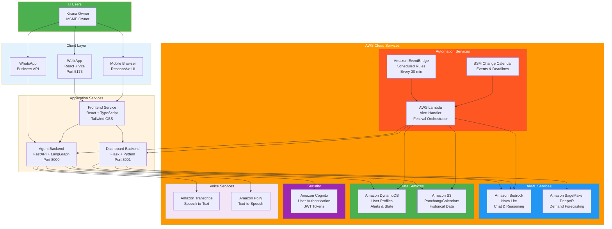
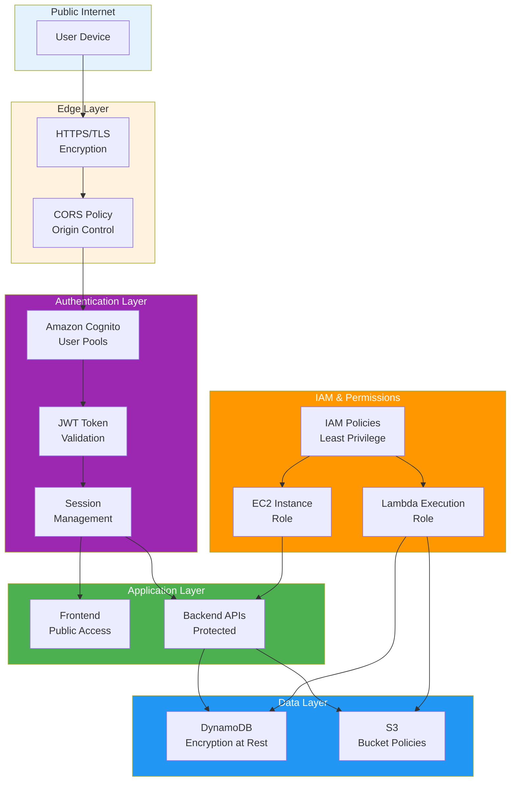
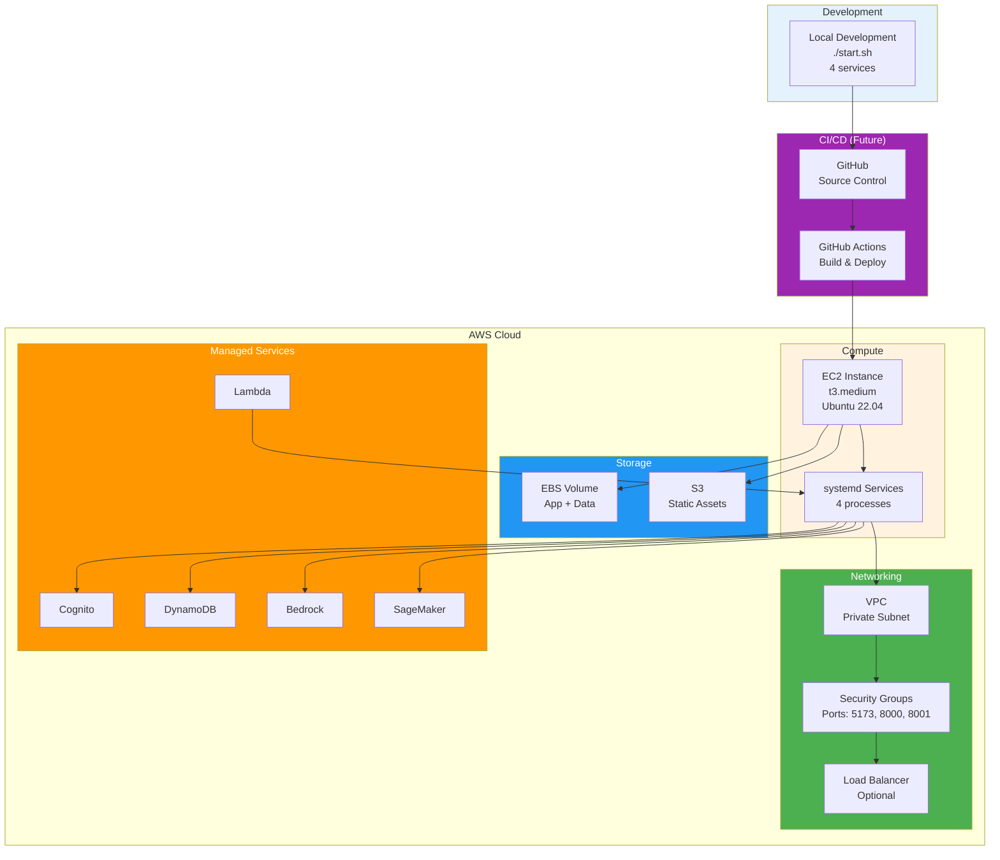
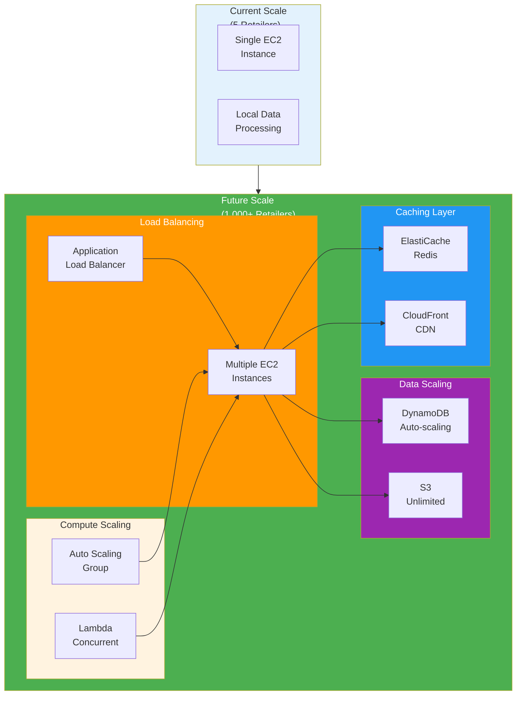
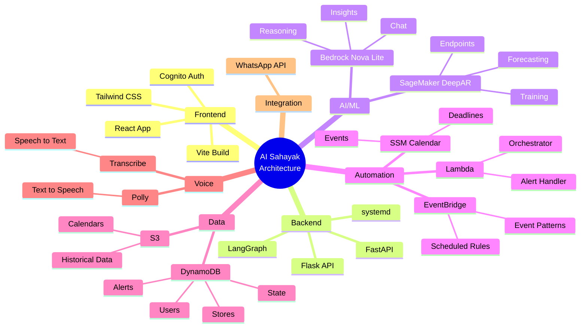

# AI Sahayak - Architecture Diagrams

## 1. High-Level System Architecture



---

## 2. Detailed Component Architecture

```mermaid
flowchart LR
    subgraph User["User Interface"]
        Browser[Web Browser<br/>Chrome/Safari]
        WA[WhatsApp]
    end
    
    subgraph Frontend["Frontend (Port 5173)"]
        Landing[Landing Page]
        Onboard[Onboarding Chat]
        Dashboard[Dashboard Home]
        MyDay[My Day Chat]
        Control[Control Centre<br/>iframe]
    end
    
    subgraph AgentAPI["Agent Backend (Port 8000)"]
        ChatAPI[/v1/chat<br/>Chat Endpoint]
        AlertAPI[/v1/alerts<br/>Alert Management]
        WebhookAPI[/v1/webhook<br/>WhatsApp Handler]
        ProfileAPI[/v1/profile<br/>User Profile]
        TTSAPI[/v1/tts<br/>Voice Output]
        
        LangGraph[LangGraph Engine<br/>Multi-Agent System]
        
        SalesAgent[Sales Agent]
        InvAgent[Inventory Agent]
        PriceAgent[Pricing Agent]
        ForecastAgent[Forecast Agent]
        AlertAgent[Alert Prefs Agent]
    end
    
    subgraph DashAPI["Dashboard API (Port 8001)"]
        KPIRoute[/api/kpis<br/>Business Metrics]
        ForecastRoute[/api/forecast<br/>Demand Prediction]
        PriceRoute[/api/price<br/>Price Analysis]
        WhatIfRoute[/api/whatif<br/>Simulator]
        StatusRoute[/api/model-status<br/>Health Check]
    end
    
    Browser --> Landing
    Landing --> Onboard
    Onboard --> Dashboard
    Dashboard --> MyDay
    Dashboard --> Control
    
    MyDay --> ChatAPI
    MyDay --> AlertAPI
    MyDay --> TTSAPI
    
    Control --> KPIRoute
    Control --> ForecastRoute
    Control --> PriceRoute
    Control --> WhatIfRoute
    
    ChatAPI --> LangGraph
    LangGraph --> SalesAgent
    LangGraph --> InvAgent
    LangGraph --> PriceAgent
    LangGraph --> ForecastAgent
    LangGraph --> AlertAgent
    
    WA --> WebhookAPI
    WebhookAPI --> LangGraph
    
    style User fill:#4caf50,color:#fff
    style Frontend fill:#e3f2fd
    style AgentAPI fill:#fff3e0
    style DashAPI fill:#f3e5f5
    style LangGraph fill:#2196f3,color:#fff
```

---

## 3. Proactive Alert Architecture

```mermaid
flowchart TB
    subgraph Trigger["Alert Triggers"]
        EB[Amazon EventBridge<br/>Cron: rate(30 minutes)]
        Manual[Manual Invoke<br/>Testing]
    end
    
    subgraph Lambda["Lambda Function"]
        Handler[alerts_handler.py]
        
        CheckTime[Check Current Time<br/>IST]
        GetUsers[Get All Users<br/>from DynamoDB]
        FilterUsers[Filter by<br/>alert_time_hour_ist]
        
        FetchCal[Fetch Calendar<br/>from S3]
        FetchNews[Fetch RSS News<br/>GST, Commodities]
        CheckEvents{Upcoming<br/>Events?}
        
        GetProfile[Get User Profile<br/>City, State, Business]
        GetKPIs[Get Business KPIs<br/>Dashboard API]
        GetForecast[Get Demand Forecast<br/>SageMaker]
        
        GenAlert[Generate Alert<br/>Bedrock Nova Lite]
        FormatAlert[Format Hinglish<br/>Message]
    end
    
    subgraph Delivery["Alert Delivery"]
        Webhook[POST to Backend<br/>/v1/alerts/incoming]
        Store[Store in DynamoDB<br/>alerts table]
        Push[Push to Frontend<br/>SSE/WebSocket]
        WADeliver[Send to WhatsApp<br/>Business API]
    end
    
    subgraph UserView["User Sees Alert"]
        MyDayUI[My Day Chat<br/>Alert Card]
        WAChat[WhatsApp<br/>Message]
    end
    
    EB --> Handler
    Manual --> Handler
    
    Handler --> CheckTime
    CheckTime --> GetUsers
    GetUsers --> FilterUsers
    
    FilterUsers --> FetchCal
    FetchCal --> FetchNews
    FetchNews --> CheckEvents
    
    CheckEvents -->|Yes| GetProfile
    CheckEvents -->|No| End1([No Alert])
    
    GetProfile --> GetKPIs
    GetKPIs --> GetForecast
    GetForecast --> GenAlert
    
    GenAlert --> FormatAlert
    FormatAlert --> Webhook
    
    Webhook --> Store
    Store --> Push
    Store --> WADeliver
    
    Push --> MyDayUI
    WADeliver --> WAChat
    
    style Trigger fill:#ff9800,color:#fff
    style Lambda fill:#4caf50,color:#fff
    style Delivery fill:#2196f3,color:#fff
    style UserView fill:#9c27b0,color:#fff
```

---

## 4. Data Flow Architecture

```mermaid
flowchart LR
    subgraph Input["Data Input"]
        UserQuery[User Query<br/>"Sales kaisa hai?"]
        VoiceInput[Voice Input<br/>Transcribe]
        AlertTrigger[Alert Trigger<br/>EventBridge]
    end
    
    subgraph Processing["Data Processing"]
        LangGraph[LangGraph Router<br/>Intent Detection]
        
        Tools[Agent Tools]
        DashTool[Dashboard Tool<br/>Live KPIs]
        DBTool[DynamoDB Tool<br/>User Data]
        BedrockTool[Bedrock Tool<br/>AI Analysis]
        SageMakerTool[SageMaker Tool<br/>Forecasting]
    end
    
    subgraph DataSources["Data Sources"]
        DynamoDB[(DynamoDB<br/>Users, Stores, State)]
        S3[(S3<br/>Historical Data)]
        DashAPI[Dashboard API<br/>Real-time KPIs]
    end
    
    subgraph AI["AI Processing"]
        Bedrock[Bedrock Nova Lite<br/>Reasoning]
        SageMaker[SageMaker DeepAR<br/>Forecasting]
    end
    
    subgraph Output["Data Output"]
        Response[Hinglish Response]
        VoiceOutput[Voice Output<br/>Polly]
        Alert[Alert Notification]
        Chart[Chart Data<br/>Dashboard API]
    end
    
    UserQuery --> LangGraph
    VoiceInput --> LangGraph
    AlertTrigger --> LangGraph
    
    LangGraph --> Tools
    
    Tools --> DashTool
    Tools --> DBTool
    Tools --> BedrockTool
    Tools --> SageMakerTool
    
    DashTool --> DashAPI
    DBTool --> DynamoDB
    BedrockTool --> Bedrock
    SageMakerTool --> SageMaker
    
    DashAPI --> S3
    
    Bedrock --> Response
    Bedrock --> Alert
    SageMaker --> Chart
    Response --> VoiceOutput
    
    style Input fill:#e3f2fd
    style Processing fill:#fff3e0
    style DataSources fill:#4caf50,color:#fff
    style AI fill:#2196f3,color:#fff
    style Output fill:#9c27b0,color:#fff
```

---

## 5. Security Architecture



---

## 6. Deployment Architecture



---

## 7. Scalability Architecture



---

## 8. AWS Service Integration Map



---

## Architecture Layers Explained

### Layer 1: User Interface
- **Web App**: React-based responsive UI
- **Mobile**: Mobile-optimized views
- **WhatsApp**: Alternative channel for alerts

### Layer 2: Application Services
- **Frontend Service**: React + TypeScript (Port 5173)
- **Agent Backend**: FastAPI + LangGraph (Port 8000)
- **Dashboard Backend**: Flask + Python (Port 8001)

### Layer 3: AWS AI/ML Services
- **Bedrock**: Chat understanding and response generation
- **SageMaker**: Demand forecasting with DeepAR

### Layer 4: Automation Services
- **EventBridge**: Scheduled triggers every 30 minutes
- **Lambda**: Serverless alert processing
- **SSM Calendar**: Event and deadline management

### Layer 5: Data Services
- **DynamoDB**: User profiles, store data, alert preferences, conversation state (low latency)
- **S3**: Panchang/calendars, static data, historical records
- *(MongoDB is optional/deprecated in this codebase.)*

### Layer 6: Security & Auth
- **Cognito**: User authentication and JWT tokens
- **IAM**: Role-based access control
- **Encryption**: At rest and in transit

### Layer 7: Voice Services
- **Transcribe**: Convert speech to text (Hinglish)
- **Polly**: Convert text to speech (voice responses)

---

## Key Architecture Decisions

### 1. Microservices Approach
**Why**: Separation of concerns, independent scaling
- Frontend service (UI)
- Agent backend (Chat + AI)
- Dashboard backend (Analytics)
- Lambda functions (Alerts)

### 2. Event-Driven Architecture
**Why**: Proactive intelligence, not just reactive
- EventBridge triggers Lambda on schedule
- Lambda generates alerts based on calendar
- Alerts pushed to users automatically

### 3. Serverless Components
**Why**: Cost optimization, auto-scaling
- Lambda for alert processing
- DynamoDB for user data
- S3 for static storage
- Cognito for authentication

### 4. Multi-Agent System
**Why**: Specialized handling per domain
- Sales agent for revenue queries
- Inventory agent for stock queries
- Pricing agent for price optimization
- Forecast agent for demand prediction

### 5. Data Store Strategy
**Why**: Single primary store for simplicity and latency
- DynamoDB: User profiles, alert preferences, conversation/session state
- S3: Panchang, calendars, historical data

---

## Data Flow Examples

### Example 1: User Asks Question
```
User: "Sales kaisa hai?"
  ↓
Frontend → Agent Backend (/v1/chat)
  ↓
LangGraph → Sales Agent
  ↓
Dashboard Tool → Dashboard API (/api/kpis)
  ↓
DynamoDB → Fetch user's store data
  ↓
Bedrock → Generate Hinglish response
  ↓
Response: "Aaj ka sales ₹15,240 hai, kal se 12% zyada!"
```

### Example 2: Proactive Alert
```
EventBridge (2:00 PM IST)
  ↓
Lambda: alerts_handler
  ↓
Check DynamoDB: Users with alert_time = 14:00
  ↓
Fetch S3: Calendar shows Diwali in 3 days
  ↓
Dashboard API: Get current stock levels
  ↓
SageMaker: Get demand forecast
  ↓
Bedrock: Generate alert message
  ↓
POST to Backend: /v1/alerts/incoming
  ↓
Store in DynamoDB + Push to Frontend
  ↓
User sees: "Diwali 3 din mein! Mithai demand 40% badhega"
```

---

## Performance Characteristics

### Latency Targets
- Chat response: < 2 seconds
- Forecast generation: < 5 seconds
- Alert delivery: < 30 seconds
- Dashboard load: < 1 second
- API calls: < 500ms

### Throughput
- Concurrent users: 100+
- Messages/second: 50+
- Alerts/day: 10,000+
- Forecasts/day: 1,000+

### Availability
- Target: 99.9% uptime
- Bedrock SLA: 99.9%
- DynamoDB SLA: 99.99%
- Lambda SLA: 99.95%

---

## Cost Architecture

### Monthly Cost Breakdown (100 users)
```
Amazon Bedrock:     $50  (chat + reasoning)
SageMaker DeepAR:   $100 (forecasting endpoints)
Lambda:             $10  (alert processing)
DynamoDB:           $25  (user data)
S3:                 $5   (storage)
EventBridge:        $2   (scheduled rules)
Cognito:            $3   (authentication)
EC2:                $30  (t3.medium)
────────────────────────
Total:              ~$225/month
Per user:           ~$2.25/month
```

### Cost Optimization Strategies
1. Serverless-first (pay per use)
2. DynamoDB on-demand pricing
3. S3 lifecycle policies
4. Lambda memory optimization
5. Bedrock batch processing

---

## Presentation Summary

### For Judges - Key Architecture Highlights:

1. ✅ **10 AWS Services** - Comprehensive cloud integration
2. ✅ **Event-Driven** - Proactive, not reactive
3. ✅ **Microservices** - Scalable, maintainable
4. ✅ **Serverless** - Cost-effective, auto-scaling
5. ✅ **Multi-Agent AI** - Specialized intelligence
6. ✅ **Real-time** - Fast responses, live data
7. ✅ **Secure** - Cognito + encryption + IAM
8. ✅ **Scalable** - 5 → 1,000+ retailers ready

### One-Liner:
"AI Sahayak uses a modern, event-driven microservices architecture on AWS, combining Bedrock AI, SageMaker ML, and serverless automation to deliver proactive business intelligence to Indian MSMEs."

---

## Diagram Usage Tips

### For PowerPoint:
1. **Diagram 1** (High-Level) - Overall system view
2. **Diagram 3** (Proactive Alert) - Shows the "wow" factor
3. **Diagram 4** (Data Flow) - Shows intelligence
4. **Diagram 8** (Service Map) - Shows AWS integration

### Rendering:
- Use https://mermaid.live/ to export as PNG/SVG
- Or use Mermaid extension in VS Code
- High resolution for presentation

### Key Points to Emphasize:
- Event-driven proactive alerts
- Multi-agent AI system
- Serverless cost optimization
- Scalable architecture
- Comprehensive AWS integration
