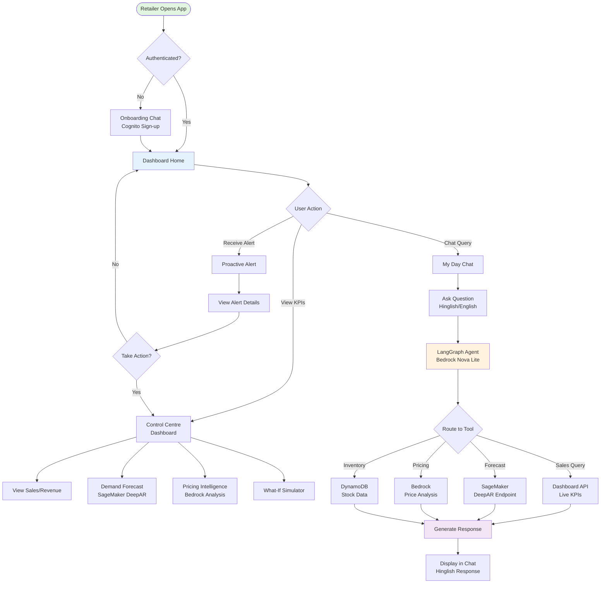

# AI Sahayak - Process Flow Diagrams

## 1. Overall System Process Flow



## 2. Proactive Alert Pipeline Flow

```mermaid
flowchart LR
    subgraph Trigger["Alert Trigger"]
        EB[EventBridge<br/>Scheduled Rule<br/>Every 30 min]
        Calendar[AWS Change Calendar<br/>SSM Parameter Store]
    end
    
    subgraph Lambda["Lambda Processing"]
        LambdaFunc[alerts_handler.py]
        CheckTime{Check User<br/>Alert Time}
        FetchCal[Fetch Calendar<br/>from S3]
        FetchNews[Fetch RSS News<br/>GST, Commodities]
        CheckEvents{Upcoming<br/>Events?}
    end
    
    subgraph Context["Context Gathering"]
        GetUser[Get User Profile<br/>DynamoDB]
        GetKPI[Get Business KPIs<br/>Dashboard API]
        GetForecast[Get Demand Forecast<br/>SageMaker]
    end
    
    subgraph Generation["Alert Generation"]
        Bedrock[Bedrock Nova Lite<br/>Generate Hinglish Alert]
        Format[Format Alert<br/>with Context]
    end
    
    subgraph Delivery["Alert Delivery"]
        Webhook[POST to Backend<br/>Webhook API]
        Store[Store in Alert DB<br/>DynamoDB]
        Push[Push to Frontend<br/>SSE/WebSocket]
        WA[WhatsApp<br/>Business API]
    end
    
    subgraph User["User Interface"]
        MyDay[My Day Chat<br/>Alert Appears]
        WAChat[WhatsApp<br/>Message]
    end
    
    EB --> LambdaFunc
    Calendar --> LambdaFunc
    LambdaFunc --> CheckTime
    CheckTime -->|Time Match| FetchCal
    CheckTime -->|No Match| End1([Skip])
    FetchCal --> FetchNews
    FetchNews --> CheckEvents
    CheckEvents -->|Yes| GetUser
    CheckEvents -->|No| End2([No Alert])
    
    GetUser --> GetKPI
    GetKPI --> GetForecast
    GetForecast --> Bedrock
    
    Bedrock --> Format
    Format --> Webhook
    Webhook --> Store
    Store --> Push
    Store --> WA
    
    Push --> MyDay
    WA --> WAChat
    
    style EB fill:#ff9800
    style LambdaFunc fill:#4caf50
    style Bedrock fill:#2196f3
    style MyDay fill:#9c27b0
```



## 3. Reactive Chat Flow (My Day)

```mermaid
flowchart TB
    User[User Types Query<br/>"Sales kaisa hai?"]
    
    User --> Detect{Language<br/>Detection}
    Detect --> Process[Process Input<br/>Hinglish/English]
    
    Process --> Backend[FastAPI Backend<br/>/v1/chat]
    Backend --> Session[Load Session<br/>MongoDB Memory]
    
    Session --> LangGraph[LangGraph<br/>Retail Assistant]
    
    LangGraph --> Router{Intent<br/>Classification}
    
    Router -->|Sales| SalesAgent[Sales Workflow]
    Router -->|Inventory| InvAgent[Inventory Workflow]
    Router -->|Pricing| PriceAgent[Pricing Workflow]
    Router -->|Forecast| ForecastAgent[Forecast Workflow]
    Router -->|Alert Prefs| AlertAgent[Alert Preferences]
    Router -->|General| GenAgent[General Chat]
    
    SalesAgent --> DashTool[Dashboard Data Tool<br/>GET /api/kpis]
    InvAgent --> DynamoTool[DynamoDB Tool<br/>Stock Query]
    PriceAgent --> BedrockTool[Bedrock Tool<br/>Price Analysis]
    ForecastAgent --> SageMakerTool[SageMaker Tool<br/>DeepAR Forecast]
    AlertAgent --> ProfileTool[Profile Tool<br/>Update DynamoDB]
    GenAgent --> BedrockChat[Bedrock Chat<br/>General Response]
    
    DashTool --> Aggregate[Aggregate Results]
    DynamoTool --> Aggregate
    BedrockTool --> Aggregate
    SageMakerTool --> Aggregate
    ProfileTool --> Aggregate
    BedrockChat --> Aggregate
    
    Aggregate --> Generate[Generate Response<br/>Bedrock Nova Lite]
    Generate --> Translate{Translate?}
    Translate -->|Yes| Bhashini[Bhashini API<br/>Translation]
    Translate -->|No| Format
    Bhashini --> Format[Format Response<br/>Hinglish]
    
    Format --> Voice{Voice<br/>Enabled?}
    Voice -->|Yes| Polly[Amazon Polly<br/>Text-to-Speech]
    Voice -->|No| Return
    Polly --> Return[Return to User]
    
    Return --> Display[Display in Chat<br/>+ Save to MongoDB]
    
    style User fill:#e1f5e1
    style LangGraph fill:#fff3e0
    style Generate fill:#f3e5f5
    style Display fill:#e3f2fd
```

## 4. Demand Forecasting Flow

```mermaid
flowchart LR
    subgraph Input["Data Input"]
        Historical[Historical Sales Data<br/>2 Years<br/>CSV Files]
        Calendar[Calendar Events<br/>Festivals, Holidays]
        External[External Factors<br/>Weather, News]
    end
    
    subgraph Processing["Data Processing"]
        Clean[Data Cleaning<br/>Pandas]
        Feature[Feature Engineering<br/>Lag, Rolling Avg]
        Split[Train/Test Split]
    end
    
    subgraph Models["Forecasting Models"]
        DeepAR[SageMaker DeepAR<br/>Primary Model]
        Prophet[Prophet Ensemble<br/>Fallback Model]
        Check{DeepAR<br/>Available?}
    end
    
    subgraph Enhancement["AI Enhancement"]
        Bedrock[Bedrock Analysis<br/>Explain Forecast]
        Context[Add Context<br/>Events, Trends]
    end
    
    subgraph Output["Output"]
        Forecast[7-Day Forecast<br/>Per SKU]
        Confidence[Confidence Intervals]
        Insights[AI Insights<br/>Hinglish]
        Viz[Visualization<br/>Recharts]
    end
    
    Historical --> Clean
    Calendar --> Feature
    External --> Feature
    Clean --> Feature
    Feature --> Split
    
    Split --> Check
    Check -->|Yes| DeepAR
    Check -->|No| Prophet
    
    DeepAR --> Bedrock
    Prophet --> Bedrock
    
    Bedrock --> Context
    Context --> Forecast
    Context --> Confidence
    Context --> Insights
    
    Forecast --> Viz
    Confidence --> Viz
    Insights --> Viz
    
    Viz --> Dashboard[Control Centre<br/>Dashboard Display]
    
    style DeepAR fill:#ff9800
    style Bedrock fill:#2196f3
    style Dashboard fill:#4caf50
```



## 5. User Journey Flow

```mermaid
flowchart TB
    Start([New User<br/>Small Shop Owner])
    
    Start --> Landing[Landing Page<br/>Learn About AI Sahayak]
    Landing --> Decide{Interested?}
    Decide -->|No| Exit1([Exit])
    Decide -->|Yes| Onboard[Start Onboarding]
    
    Onboard --> ChatOnboard[Chat-based Onboarding<br/>Collect Business Info]
    ChatOnboard --> Q1[Shop Name & Type]
    Q1 --> Q2[Location & Language]
    Q2 --> Q3[Business Size]
    Q3 --> Signup[Cognito Sign-up<br/>Create Account]
    
    Signup --> FirstLogin[First Login]
    FirstLogin --> Welcome[Welcome Screen<br/>Quick Tour]
    
    Welcome --> MainDash[Main Dashboard]
    
    MainDash --> Explore{User Explores}
    
    Explore -->|View KPIs| CC[Control Centre<br/>See Sales, Inventory]
    Explore -->|Ask Question| Chat[My Day Chat<br/>Ask in Hinglish]
    Explore -->|Set Preferences| Prefs[Set Alert Time<br/>"2 pm ko bhejo"]
    
    CC --> Forecast[View Demand Forecast<br/>Next 7 Days]
    Forecast --> Price[Check Pricing<br/>Recommendations]
    Price --> WhatIf[Try What-If<br/>Simulator]
    
    Chat --> GetAnswer[Get AI Response<br/>Bedrock + Live Data]
    GetAnswer --> Satisfied{Satisfied?}
    Satisfied -->|No| Chat
    Satisfied -->|Yes| MainDash
    
    Prefs --> Save[Save to DynamoDB<br/>Alert Preferences]
    Save --> Wait[Wait for Alert Time]
    
    Wait --> AlertTime{Alert Time<br/>Reached?}
    AlertTime -->|Yes| ReceiveAlert[Receive Proactive Alert<br/>"Festival kal hai!"]
    AlertTime -->|No| Wait
    
    ReceiveAlert --> ReadAlert[Read Alert in My Day]
    ReadAlert --> TakeAction{Take Action?}
    TakeAction -->|Yes| CC
    TakeAction -->|No| MainDash
    
    WhatIf --> MainDash
    
    MainDash --> Daily[Daily Usage<br/>Check Alerts & KPIs]
    Daily --> Value[Business Value<br/>Better Decisions]
    
    style Start fill:#e1f5e1
    style Value fill:#4caf50
    style ReceiveAlert fill:#ff9800
    style GetAnswer fill:#2196f3
```

## Diagram Usage Instructions

### For PowerPoint/Presentation:
1. Copy each Mermaid code block
2. Use online tools:
   - https://mermaid.live/ (render and export as PNG/SVG)
   - https://mermaid.ink/ (generate image URLs)
3. Or use VS Code with Mermaid extension to export

### Recommended Diagrams for Presentation:
- **Slide 1**: Overall System Process Flow (shows complete user journey)
- **Slide 2**: Proactive Alert Pipeline (shows the "wow" factor)
- **Slide 3**: Reactive Chat Flow (shows AI intelligence)
- **Slide 4**: User Journey Flow (shows end-to-end experience)

### Color Legend:
- 🟢 Green: User touchpoints
- 🟠 Orange: AWS services (EventBridge, SageMaker)
- 🔵 Blue: AI/ML components (Bedrock, LangGraph)
- 🟣 Purple: Output/Results
