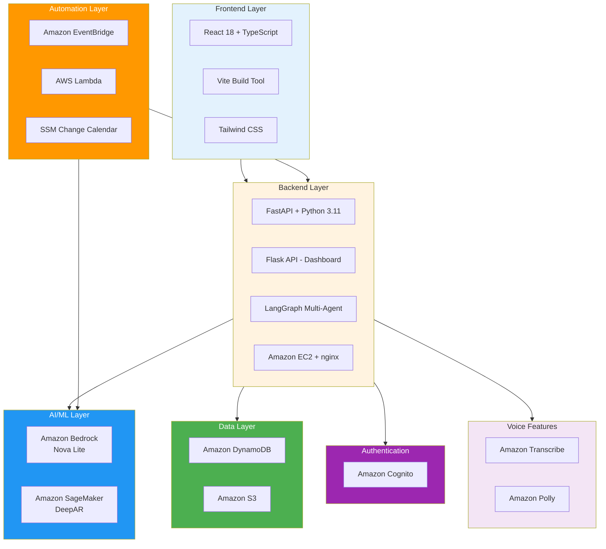

# AI Sahayak - Technology Stack

## Technology Architecture Overview



---

## AWS Services Used

### 1. Amazon Bedrock (Nova Lite)
**Purpose**: AI Chat & Reasoning Engine

**Usage**:
- Hinglish conversation understanding
- Business insights generation
- Pricing recommendations
- Natural language responses
- Context-aware reasoning

**Why Chosen**:
- Multi-lingual support (Hindi + English)
- Low latency for real-time chat
- Cost-effective for small business scale
- Serverless - no infrastructure management

**API Calls**:
```python
bedrock_runtime.invoke_model(
    modelId='us.amazon.nova-lite-v1:0',
    body=json.dumps({
        "messages": [{"role": "user", "content": "Sales kaisa hai?"}],
        "inferenceConfig": {"temperature": 0.7}
    })
)
```

---

### 2. Amazon SageMaker (DeepAR)
**Purpose**: Demand Forecasting

**Usage**:
- 7-day demand prediction per SKU
- Seasonal pattern detection
- Festival impact analysis
- Inventory planning

**Why Chosen**:
- Purpose-built for time-series forecasting
- Handles multiple products simultaneously
- Learns from 2 years of historical data
- Confidence intervals for predictions

**Model Training**:
- Input: 2 years sales data per retailer
- Features: Date, SKU, quantity, price, festivals
- Output: 7-day forecast with confidence bands

---

### 3. AWS Lambda
**Purpose**: Serverless Alert Engine

**Usage**:
- Festival alert orchestrator
- Calendar event processor
- News aggregator (RSS feeds)
- Webhook handler for alerts

**Why Chosen**:
- Event-driven architecture
- Pay only for execution time
- Auto-scaling
- Easy integration with EventBridge

**Functions**:
1. `alerts_handler.py` - Daily alert generation
2. `festival_orchestrator.py` - Event-based triggers

---

### 4. Amazon EventBridge
**Purpose**: Scheduled Triggers

**Usage**:
- Trigger alerts every 30 minutes
- Check user alert time preferences
- Schedule daily summaries
- Calendar event monitoring

**Why Chosen**:
- Reliable scheduling
- Cron-based rules
- Native Lambda integration
- Event pattern matching

**Rules**:
```json
{
  "schedule": "rate(30 minutes)",
  "target": "alerts-handler-lambda"
}
```

---

### 5. Amazon DynamoDB
**Purpose**: User Profiles & Real-time Data

**Tables**:
1. `ai-sahayak-users` - 5 demo retailers + alert preferences
2. `ai_sahayak_stores` - Store profiles
3. `ai_sahayak_user_info` - Onboarding data

**Why Chosen**:
- Single-digit millisecond latency
- Serverless and auto-scaling
- Perfect for user profiles
- Strong consistency for alerts

**Schema Example**:
```json
{
  "user_id": "raju",
  "display_name": "Raju Bhai",
  "city": "Indore",
  "state": "MP",
  "alert_time_hour_ist": 14,
  "alert_time_minute_ist": 0
}
```

---

### 6. Amazon Cognito
**Purpose**: User Authentication

**Usage**:
- User sign-up/sign-in
- JWT token management
- Password reset
- Session management

**Why Chosen**:
- Secure authentication out-of-the-box
- OAuth 2.0 support
- User pools for scalability
- MFA support (future)

---

### 7. Amazon S3
**Purpose**: Static Data Storage

**Usage**:
- National & regional calendars (JSON)
- Historical sales data (CSV)
- Model artifacts
- Static assets

**Why Chosen**:
- Durable storage (99.999999999%)
- Low cost
- Easy Lambda integration
- Versioning support

---

### 8. AWS Systems Manager (Change Calendar)
**Purpose**: Event Calendar Management

**Usage**:
- Festival dates
- Compliance deadlines
- Seasonal events
- Regional holidays

**Why Chosen**:
- Centralized calendar management
- API access for automation
- Multi-region support
- Easy updates

---

### 9. Amazon Transcribe
**Purpose**: Speech-to-Text

**Usage**:
- Voice queries in chat
- Hinglish speech recognition
- Onboarding voice input

**Why Chosen**:
- Supports Indian English
- Real-time streaming
- Custom vocabulary support

---

### 10. Amazon Polly
**Purpose**: Text-to-Speech

**Usage**:
- Voice responses in chat
- Alert audio notifications
- Accessibility feature

**Why Chosen**:
- Natural-sounding voices
- Supports Hindi + English
- SSML for pronunciation control

---

## Non-AWS Technologies

### Frontend Technologies

#### React 18 + TypeScript
**Purpose**: UI Framework
- Component-based architecture
- Type safety with TypeScript
- Virtual DOM for performance
- Rich ecosystem

#### Vite
**Purpose**: Build Tool
- Fast HMR (Hot Module Replacement)
- Optimized production builds
- ES modules support

#### Tailwind CSS
**Purpose**: Styling
- Utility-first CSS
- Responsive design
- Consistent design system
- Small bundle size

#### Data visualization
**Purpose**: Charts and KPIs
- Dashboard API (Flask) serves KPI and forecast data
- Frontend displays metrics and SageMaker-style chart data from API (no Recharts in main app package)

#### Lucide React
**Purpose**: Icons
- Modern icon library
- Tree-shakeable
- Consistent design

---

### Backend Technologies

#### FastAPI
**Purpose**: Main Backend Framework
- High performance (async)
- Auto API documentation
- Type hints with Pydantic
- WebSocket support for real-time

**Key Routes**:
```python
/v1/chat          # Chat endpoint
/v1/alerts/*      # Alert management
/v1/webhook       # WhatsApp webhook
/v1/profile       # User profile
/v1/tts           # Text-to-speech
```

#### Flask
**Purpose**: Dashboard API
- Lightweight
- Easy integration
- RESTful API
- Pandas integration

**Key Routes**:
```python
/api/kpis         # Business KPIs
/api/forecast     # Demand forecast
/api/price        # Pricing analysis
/api/whatif       # Simulator
/api/model-status # Health check
```

#### LangGraph
**Purpose**: Multi-Agent Orchestration
- Workflow management
- Agent routing
- State management
- Tool integration

**Workflows**:
- Sales agent
- Inventory agent
- Pricing agent
- Forecast agent
- Alert preferences agent

---

### AI/ML Technologies

#### Pandas + NumPy
**Purpose**: Data Processing
- Data cleaning
- Feature engineering
- Statistical analysis
- CSV/JSON handling

#### Scikit-learn
**Purpose**: ML Utilities
- Data preprocessing
- Model evaluation
- Feature scaling

---

### Data & Storage

#### Amazon DynamoDB (primary)
**Purpose**: User profiles, preferences, conversation state
- `ai-sahayak-users` - demo retailers, alert preferences
- Store-level data isolation
- Single-digit ms latency

*(MongoDB is optional/deprecated in this codebase; DynamoDB is used for conversation and profiles.)*

---

### Integration Technologies

#### WhatsApp Business API
**Purpose**: Multi-channel Delivery
- Send alerts to WhatsApp
- Receive user queries
- Rich media support
- Business verification

---

## Development & Deployment

### Infrastructure
- **Amazon EC2** - Application hosting (FastAPI, Flask Dashboard, nginx)
- **systemd** - Service management on EC2
- **nginx** - Reverse proxy

### Version Control
- **Git** - Source control
- **GitHub** - Repository hosting

### Package Management
- **npm** - Frontend dependencies
- **pip** - Python dependencies
- **Poetry** (optional) - Python dependency management

---

## Technology Stack Summary Table

| Layer | Technology | Purpose | Why Chosen |
|-------|-----------|---------|------------|
| **AI/LLM** | Amazon Bedrock (Nova Lite) | Chat & reasoning | Multi-lingual, low latency |
| **Forecasting** | SageMaker DeepAR | Demand prediction | Purpose-built for time-series |
| **Backend** | FastAPI + Python 3.11 | API server | High performance, async |
| **Agents** | LangGraph | Multi-agent orchestration | Workflow management |
| **Frontend** | React + TypeScript | UI framework | Component-based, type-safe |
| **Styling** | Tailwind CSS | UI design | Utility-first, responsive |
| **Charts / UI** | Dashboard API + in-app data | KPIs, forecast display | Flask serves; React displays |
| **Auth** | Amazon Cognito | User authentication | Secure, scalable |
| **Database** | Amazon DynamoDB | Users, alerts, state | Low latency, serverless |
| **Compute / Hosting** | AWS Lambda, Amazon EC2 | APIs, alerts; app hosting | Serverless + EC2 + nginx |
| **Storage** | Amazon S3 | File storage | Durable, low cost |
| **Automation** | Lambda + EventBridge | Scheduled alerts | Serverless, event-driven |
| **Voice** | Transcribe + Polly | Speech I/O | Hinglish support |
| **Calendar** | SSM Change Calendar | Event management | Centralized, API access |
| **Messaging** | WhatsApp Business API | Multi-channel | User preference |

---

## Architecture Patterns

### 1. Microservices Architecture
- Frontend (React)
- Backend Agents (FastAPI)
- Dashboard API (Flask)
- Lambda Functions (Alerts)

### 2. Event-Driven Architecture
- EventBridge triggers
- Lambda processors
- Webhook handlers
- Real-time updates

### 3. Multi-Agent System
- LangGraph orchestration
- Specialized agents per domain
- Tool-based architecture
- State management

### 4. Serverless Components
- Lambda functions
- DynamoDB
- S3
- EventBridge
- Cognito

---

## Scalability & Performance

### Current Scale
- 5 demo retailers
- ~100 SKUs per retailer
- 2 years historical data
- Real-time chat responses

### Designed to Scale
- **Users**: 1,000+ retailers
- **Data**: Millions of transactions
- **Forecasts**: 10,000+ SKUs
- **Alerts**: 100,000+ daily

### Performance Metrics
- Chat response: < 2 seconds
- Forecast generation: < 5 seconds
- Alert delivery: < 30 seconds
- Dashboard load: < 1 second

---

## Security Features

### Authentication & Authorization
- Cognito user pools
- JWT tokens
- Role-based access (future)

### Data Security
- Encryption at rest (DynamoDB, S3)
- Encryption in transit (HTTPS)
- VPC for backend (production)

### API Security
- Rate limiting
- Input validation
- CORS configuration
- API keys for external services

---

## Cost Optimization

### Serverless-First
- Pay only for usage
- Auto-scaling
- No idle costs

### Right-Sizing
- Lambda memory optimization
- DynamoDB on-demand pricing
- S3 lifecycle policies

### Estimated Monthly Cost (100 users)
- Bedrock: ~$50
- SageMaker: ~$100
- Lambda: ~$10
- DynamoDB: ~$25
- S3: ~$5
- **Total: ~$190/month**

---

## Future Technology Additions

### Planned Enhancements
1. **Amazon Kendra** - Document search
2. **Amazon Comprehend** - Sentiment analysis
3. **Amazon Forecast** - Alternative to DeepAR
4. **AWS AppSync** - GraphQL API
5. **Amazon CloudWatch** - Advanced monitoring
6. **AWS X-Ray** - Distributed tracing

---

## Presentation Summary

### Key Technology Highlights

**For Judges:**
1. ✅ **10 AWS Services** - Deep AWS integration
2. ✅ **Bedrock Nova Lite** - Latest AI model
3. ✅ **SageMaker DeepAR** - Production ML
4. ✅ **Serverless Architecture** - Cost-effective, scalable
5. ✅ **Event-Driven** - Proactive intelligence
6. ✅ **Multi-lingual** - Hinglish support
7. ✅ **Real-time** - Fast responses
8. ✅ **Secure** - Cognito + encryption

**One-Liner:**
"AI Sahayak uses 10 AWS services including Bedrock, SageMaker, and Lambda to deliver proactive, Hinglish-powered business intelligence to 63+ million Indian MSMEs."

---

## Technology Decision Rationale

### Why AWS?
- Comprehensive AI/ML services
- Serverless options for cost efficiency
- Global infrastructure
- Strong security & compliance
- Rich ecosystem

### Why Bedrock Nova Lite?
- Multi-lingual (Hindi + English)
- Low latency for chat
- Cost-effective
- Latest model (2024)

### Why SageMaker DeepAR?
- Purpose-built for forecasting
- Handles seasonality
- Confidence intervals
- Production-ready

### Why FastAPI?
- High performance (async)
- Modern Python
- Auto documentation
- Type safety

### Why React?
- Component reusability
- Rich ecosystem
- Performance (Virtual DOM)
- Developer experience

---

## Conclusion

AI Sahayak leverages a modern, scalable technology stack centered around AWS services. The architecture is:

- **Intelligent** - Bedrock + SageMaker for AI/ML
- **Proactive** - EventBridge + Lambda for automation
- **Scalable** - Serverless components
- **Secure** - Cognito + encryption
- **Cost-effective** - Pay-per-use model
- **User-friendly** - React + Hinglish support

Perfect for serving India's 63+ million MSMEs with enterprise-grade intelligence at small business prices.
