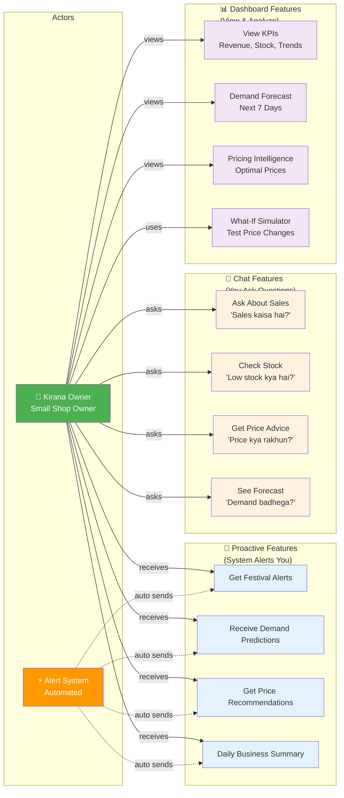
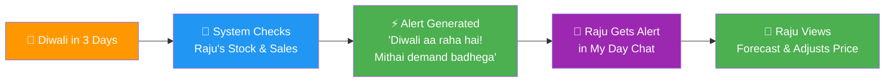
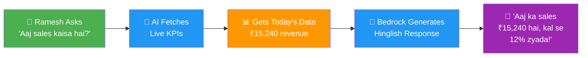
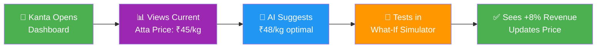
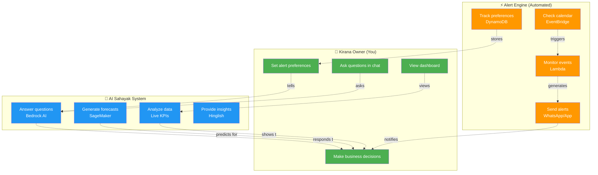
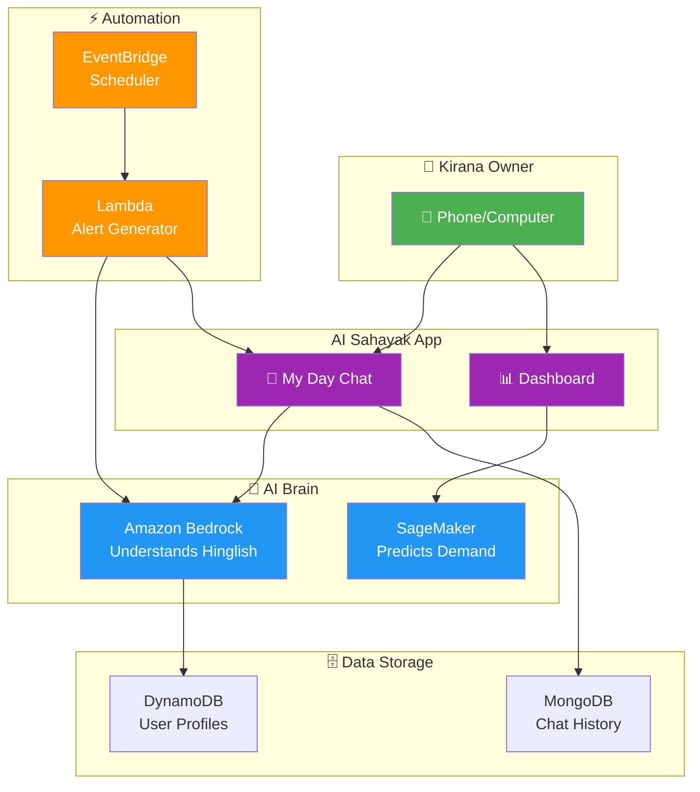
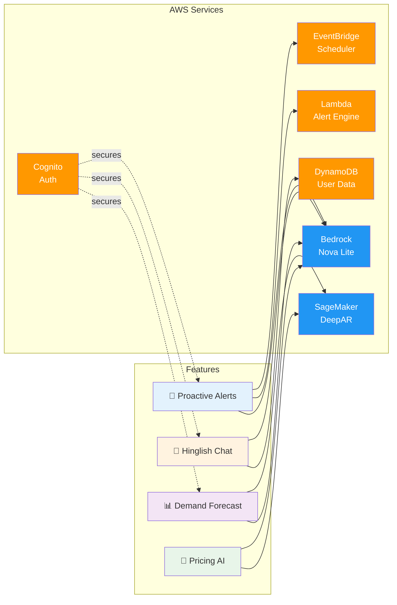

# AI Sahayak - Use Case Diagrams (Simplified)

## 1. Simple Use Case Diagram - What Users Can Do

## 2. User Scenarios - Real Examples

### Scenario 1: Festival Alert (Proactive)

### Scenario 2: Sales Question (Reactive)

### Scenario 3: Price Decision (Dashboard)

## 3. Feature Categories - Simple View

| 🔔 Proactive (System → You) | 💬 Chat (You → System) | 📊 Dashboard (Visual) |
|------------------------------|------------------------|----------------------|
| Festival alerts | Ask about sales | View KPIs |
| Demand predictions | Check inventory | See forecasts |
| Price recommendations | Get pricing advice | Pricing intelligence |
| Daily summaries | Ask any question | What-if simulator |
| Stock warnings | Voice queries | Trend analysis |

### Key Difference:
- **Proactive**: System sends alerts automatically (you don't ask)
- **Chat**: You ask questions in Hinglish, AI answers
- **Dashboard**: Visual analytics and tools

## 4. Who Does What - Actor Roles

## 5. Complete Feature List - What AI Sahayak Does

### 🔔 Proactive Features (Automated Alerts)
| Feature | Example | When |
|---------|---------|------|
| Festival Alerts | "Diwali in 3 days, stock mithai!" | Before festivals |
| Demand Predictions | "Demand spike expected tomorrow" | Daily/Weekly |
| Price Recommendations | "Competitor lowered price, adjust yours" | Price changes |
| Stock Warnings | "Atta stock low, reorder now" | Low inventory |
| Daily Summary | "Today's sales: ₹15K, up 12%" | Set time (e.g., 2 PM) |

### 💬 Chat Features (Ask Anything in Hinglish)
| Question Type | Example Query | AI Response |
|---------------|---------------|-------------|
| Sales | "Aaj sales kaisa hai?" | "₹15,240, kal se 12% zyada" |
| Inventory | "Low stock kya hai?" | "Atta 5kg left, order karo" |
| Pricing | "Price kya rakhun?" | "₹48/kg optimal hai" |
| Forecast | "Demand badhega?" | "Next week 20% increase" |
| General | "Kya karna chahiye?" | Business advice |

### 📊 Dashboard Features (Visual Analytics)
| Feature | What It Shows | Benefit |
|---------|---------------|---------|
| KPIs | Revenue, stock, top items | Quick overview |
| Demand Forecast | 7-day prediction chart | Plan inventory |
| Pricing Intelligence | Optimal prices, margins | Maximize profit |
| What-If Simulator | Impact of price changes | Test before deciding |
| Trend Analysis | Sales patterns over time | Spot opportunities |

## 6. Simple Architecture - How It Works

## 7. AWS Services - What Powers Each Feature

## 8. Quick Reference - For Your Presentation

### One-Liner Descriptions:

**Proactive Alerts**: System automatically sends business insights before you ask

**Hinglish Chat**: Ask anything in Hindi+English mix, get instant AI answers

**Demand Forecast**: AI predicts next 7 days demand using 2 years of data

**Pricing Intelligence**: AI suggests optimal prices to maximize profit

**What-If Simulator**: Test price changes before applying them

**Dashboard**: Visual KPIs - revenue, stock, trends at a glance

### Target Users:
- 63+ million MSMEs in India
- Kirana stores, small traders, manufacturers
- Limited tech knowledge, speaks Hinglish
- Needs: Better decisions, more profit, less waste

### Key Innovation:
**Proactive > Reactive** - Don't wait for questions, send alerts automatically

### AWS Services Used:
- Bedrock (Nova Lite) - AI chat & reasoning
- SageMaker (DeepAR) - Demand forecasting
- Lambda + EventBridge - Automated alerts
- DynamoDB - User profiles & data
- Cognito - Authentication
- Transcribe + Polly - Voice features

## Usage Tips for Presentation

### Best Diagrams to Use:
1. **Diagram 1** (Simple Use Case) - Shows all features clearly
2. **Diagram 2** (Scenarios) - Real examples people understand
3. **Table in Section 3** - Quick feature comparison
4. **Diagram 6** (Simple Architecture) - How it all connects

### What to Highlight:
- ✅ Three interaction modes: Proactive, Chat, Dashboard
- ✅ Hinglish support for Indian users
- ✅ Real-time data + AI predictions
- ✅ Automated alerts (the "wow" factor)
- ✅ Easy to use (chat-based, no training needed)

### Avoid:
- ❌ Too many technical details
- ❌ Complex UML notation
- ❌ Long lists of features
- ❌ Architecture complexity

Keep it simple: "AI Sahayak tells you what you need to know, when you need it, in your language."
