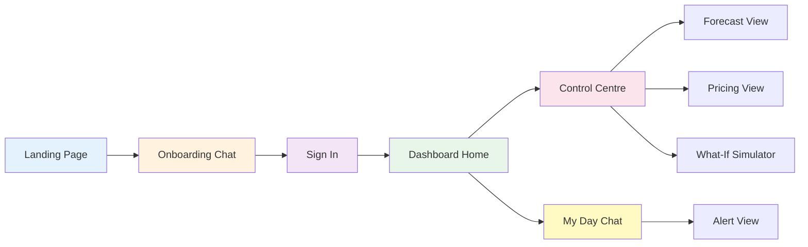
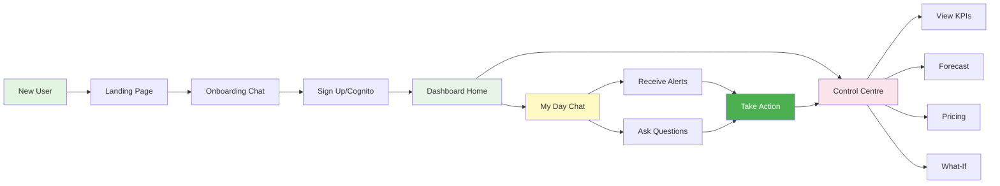

# AI Sahayak - Wireframes & UI Mockups

## Screen Flow Overview



---

## 1. Landing Page

```
┌─────────────────────────────────────────────────────────────┐
│  🛒 AI Sahayak                    [Sign In]  [Get Started]  │
├─────────────────────────────────────────────────────────────┤
│                                                              │
│              🤖 Proactive Intelligence for                   │
│                 Indian Kirana & MSMEs                        │
│                                                              │
│         "Har chhota business ka apna Sahayak"               │
│                                                              │
│              [Start Free Trial] →                           │
│                                                              │
├─────────────────────────────────────────────────────────────┤
│                                                              │
│  ┌──────────────┐  ┌──────────────┐  ┌──────────────┐     │
│  │  🔔 Alerts   │  │  💬 Chat     │  │  📊 Forecast │     │
│  │              │  │              │  │              │     │
│  │  Get festival│  │  Ask in      │  │  AI predicts │     │
│  │  & demand    │  │  Hinglish    │  │  demand      │     │
│  │  alerts      │  │              │  │              │     │
│  └──────────────┘  └──────────────┘  └──────────────┘     │
│                                                              │
└─────────────────────────────────────────────────────────────┘
```


---

## 2. Onboarding Chat Screen

```
┌─────────────────────────────────────────────────────────────┐
│  ← Back                AI Sahayak Onboarding                │
├─────────────────────────────────────────────────────────────┤
│                                                              │
│  🤖 AI Sahayak                                              │
│  ┌────────────────────────────────────────────────────┐    │
│  │ Namaste! Main aapka AI Sahayak hoon.               │    │
│  │ Aapke business ke baare mein kuch batao?           │    │
│  └────────────────────────────────────────────────────┘    │
│                                                              │
│                                          👤 Raju Bhai       │
│                      ┌────────────────────────────────┐    │
│                      │ Mera kirana store hai Indore   │    │
│                      │ mein                            │    │
│                      └────────────────────────────────┘    │
│                                                              │
│  🤖 AI Sahayak                                              │
│  ┌────────────────────────────────────────────────────┐    │
│  │ Bahut badhiya! Aap kaunse items bechte ho?         │    │
│  └────────────────────────────────────────────────────┘    │
│                                                              │
│                                          👤 Raju Bhai       │
│                      ┌────────────────────────────────┐    │
│                      │ Grocery items - atta, chawal,  │    │
│                      │ dal, tel, masale                │    │
│                      └────────────────────────────────┘    │
│                                                              │
├─────────────────────────────────────────────────────────────┤
│  Type your message...                          [🎤] [Send]  │
└─────────────────────────────────────────────────────────────┘
```


---

## 3. Dashboard Home Screen

```
┌─────────────────────────────────────────────────────────────┐
│  ☰  AI Sahayak - Raju Bhai's Store        🔔 [Profile] 👤  │
├─────────────────────────────────────────────────────────────┤
│                                                              │
│  ┌─────────────────────┐  ┌─────────────────────┐         │
│  │  📊 Control Centre  │  │  💬 My Day          │         │
│  │                     │  │                     │         │
│  │  View KPIs,         │  │  Chat & Alerts      │         │
│  │  Forecasts,         │  │                     │         │
│  │  Pricing            │  │  🔴 2 New Alerts    │         │
│  │                     │  │                     │         │
│  │  [Open →]           │  │  [Open →]           │         │
│  └─────────────────────┘  └─────────────────────┘         │
│                                                              │
│  Quick Stats (Today)                                        │
│  ┌──────────────┐ ┌──────────────┐ ┌──────────────┐       │
│  │ 💰 Revenue   │ │ 📦 Orders    │ │ ⚠️ Low Stock │       │
│  │              │ │              │ │              │       │
│  │  ₹15,240     │ │     42       │ │      3       │       │
│  │  ↑ 12%       │ │  ↑ 8%        │ │              │       │
│  └──────────────┘ └──────────────┘ └──────────────┘       │
│                                                              │
│  Top Selling Items                                          │
│  ┌────────────────────────────────────────────────────┐    │
│  │  1. Atta (10kg)          ₹450  ↑ 15 units          │    │
│  │  2. Chawal (5kg)         ₹280  ↑ 12 units          │    │
│  │  3. Toor Dal (1kg)       ₹120  ↑ 8 units           │    │
│  └────────────────────────────────────────────────────┘    │
│                                                              │
└─────────────────────────────────────────────────────────────┘
```


---

## 4. My Day - Chat with Alerts

```
┌─────────────────────────────────────────────────────────────┐
│  ← Back              My Day - Raju Bhai          [Settings] │
├─────────────────────────────────────────────────────────────┤
│                                                              │
│  🔔 ALERT - Today 9:00 AM                                   │
│  ┌────────────────────────────────────────────────────┐    │
│  │ 🎉 Diwali 3 din mein hai!                          │    │
│  │                                                     │    │
│  │ • Mithai demand 40% badhega                        │    │
│  │ • Atta stock sirf 15kg bacha hai                   │    │
│  │ • Competitor ne price 5% kam kiya                  │    │
│  │                                                     │    │
│  │ Suggestion: Stock order karo aur price check karo │    │
│  │                                                     │    │
│  │ [View Forecast] [Check Pricing]                    │    │
│  └────────────────────────────────────────────────────┘    │
│                                                              │
│  👤 Raju Bhai                                               │
│                      ┌────────────────────────────────┐    │
│                      │ Aaj ka sales kaisa hai?        │    │
│                      └────────────────────────────────┘    │
│                                                              │
│  🤖 AI Sahayak                                              │
│  ┌────────────────────────────────────────────────────┐    │
│  │ Aaj ka sales bahut accha hai! 📈                   │    │
│  │                                                     │    │
│  │ • Total Revenue: ₹15,240                           │    │
│  │ • Kal se 12% zyada                                 │    │
│  │ • 42 orders complete                               │    │
│  │                                                     │    │
│  │ Top item: Atta (15 units sold)                     │    │
│  └────────────────────────────────────────────────────┘    │
│                                                              │
│  👤 Raju Bhai                                               │
│                      ┌────────────────────────────────┐    │
│                      │ Low stock kya hai?             │    │
│                      └────────────────────────────────┘    │
│                                                              │
│  🤖 AI Sahayak                                              │
│  ┌────────────────────────────────────────────────────┐    │
│  │ Ye items low stock mein hain: ⚠️                   │    │
│  │                                                     │    │
│  │ 1. Atta (10kg) - 15kg left (reorder now!)         │    │
│  │ 2. Toor Dal - 8kg left                             │    │
│  │ 3. Cooking Oil - 12L left                          │    │
│  │                                                     │    │
│  │ Diwali aa raha hai, jaldi order kar lo!           │    │
│  └────────────────────────────────────────────────────┘    │
│                                                              │
├─────────────────────────────────────────────────────────────┤
│  Type your message...                          [🎤] [Send]  │
└─────────────────────────────────────────────────────────────┘
```


---

## 5. Control Centre - Dashboard Overview

```
┌─────────────────────────────────────────────────────────────┐
│  ← Back         Control Centre - Raju Bhai          [Export]│
├─────────────────────────────────────────────────────────────┤
│  [KPIs] [Forecast] [Pricing] [What-If] [Model Status]      │
├─────────────────────────────────────────────────────────────┤
│                                                              │
│  Business Overview                        Period: This Week │
│                                                              │
│  ┌──────────────┐ ┌──────────────┐ ┌──────────────┐       │
│  │ 💰 Revenue   │ │ 📦 Stock     │ │ 📈 Growth    │       │
│  │              │ │              │ │              │       │
│  │  ₹98,450     │ │  ₹45,200     │ │    +15%      │       │
│  │  ↑ 15%       │ │  85% filled  │ │  vs last wk  │       │
│  └──────────────┘ └──────────────┘ └──────────────┘       │
│                                                              │
│  Sales Trend (Last 7 Days)                                  │
│  ┌────────────────────────────────────────────────────┐    │
│  │  ₹20K │                                        ╱    │    │
│  │       │                                    ╱        │    │
│  │  ₹15K │                              ╱              │    │
│  │       │                        ╱                    │    │
│  │  ₹10K │                  ╱                          │    │
│  │       │            ╱                                │    │
│  │   ₹5K │      ╱                                      │    │
│  │       └──────────────────────────────────────      │    │
│  │        Mon  Tue  Wed  Thu  Fri  Sat  Sun          │    │
│  └────────────────────────────────────────────────────┘    │
│                                                              │
│  Top Products by Revenue                                    │
│  ┌────────────────────────────────────────────────────┐    │
│  │  Atta (10kg)      ████████████████░░  ₹12,450      │    │
│  │  Chawal (5kg)     ████████████░░░░░░  ₹8,920       │    │
│  │  Toor Dal (1kg)   ████████░░░░░░░░░░  ₹6,340       │    │
│  │  Cooking Oil      ██████░░░░░░░░░░░░  ₹4,580       │    │
│  └────────────────────────────────────────────────────┘    │
│                                                              │
└─────────────────────────────────────────────────────────────┘
```


---

## 6. Demand Forecast View

```
┌─────────────────────────────────────────────────────────────┐
│  ← Back         Demand Forecast - Next 7 Days       [Refresh]│
├─────────────────────────────────────────────────────────────┤
│  [KPIs] [Forecast] [Pricing] [What-If] [Model Status]      │
├─────────────────────────────────────────────────────────────┤
│                                                              │
│  🤖 AI Insight: Diwali ke karan demand 35% badhega!        │
│                                                              │
│  Forecast Model: SageMaker DeepAR ✓ Connected              │
│                                                              │
│  Demand Prediction (Units)                                  │
│  ┌────────────────────────────────────────────────────┐    │
│  │  200 │                                        ╱╲    │    │
│  │      │                                    ╱      ╲  │    │
│  │  150 │                              ╱            ╲ │    │
│  │      │                        ╱                    │    │
│  │  100 │                  ╱                          │    │
│  │      │            ╱                                │    │
│  │   50 │      ╱                                      │    │
│  │      └──────────────────────────────────────      │    │
│  │       Mon  Tue  Wed  Thu  Fri  Sat  Sun          │    │
│  │                              ↑                     │    │
│  │                          Diwali                    │    │
│  └────────────────────────────────────────────────────┘    │
│                                                              │
│  Top Items - Predicted Demand                               │
│  ┌────────────────────────────────────────────────────┐    │
│  │  📦 Atta (10kg)                                     │    │
│  │     Current Stock: 15kg  |  Predicted: 45 units    │    │
│  │     ⚠️ Order 30kg more!                             │    │
│  │                                                     │    │
│  │  📦 Mithai                                          │    │
│  │     Current Stock: 5kg   |  Predicted: 25 units    │    │
│  │     ⚠️ Order 20kg more!                             │    │
│  │                                                     │    │
│  │  📦 Cooking Oil                                     │    │
│  │     Current Stock: 12L   |  Predicted: 18 units    │    │
│  │     ✓ Stock sufficient                             │    │
│  └────────────────────────────────────────────────────┘    │
│                                                              │
│  [Download Forecast] [Set Reorder Alert]                   │
│                                                              │
└─────────────────────────────────────────────────────────────┘
```


---

## 7. Pricing Intelligence View

```
┌─────────────────────────────────────────────────────────────┐
│  ← Back         Pricing Intelligence                [Refresh]│
├─────────────────────────────────────────────────────────────┤
│  [KPIs] [Forecast] [Pricing] [What-If] [Model Status]      │
├─────────────────────────────────────────────────────────────┤
│                                                              │
│  🤖 AI Recommendation: 3 items need price adjustment        │
│                                                              │
│  Select Product:  [Atta (10kg) ▼]                          │
│                                                              │
│  ┌────────────────────────────────────────────────────┐    │
│  │  Current Price Analysis                            │    │
│  │                                                     │    │
│  │  Your Price:        ₹450/bag                       │    │
│  │  Market Average:    ₹465/bag                       │    │
│  │  Competitor Price:  ₹440/bag                       │    │
│  │                                                     │    │
│  │  Your Margin:       18%                            │    │
│  │  Optimal Margin:    22%                            │    │
│  └────────────────────────────────────────────────────┘    │
│                                                              │
│  🎯 AI Suggestion                                           │
│  ┌────────────────────────────────────────────────────┐    │
│  │  Recommended Price: ₹480/bag                       │    │
│  │                                                     │    │
│  │  Why?                                              │    │
│  │  • Diwali demand high, customers will pay more    │    │
│  │  • Your quality better than competitor             │    │
│  │  • Market can support ₹480                         │    │
│  │                                                     │    │
│  │  Expected Impact:                                  │    │
│  │  • Revenue: +12% (₹1,440 extra/week)              │    │
│  │  • Margin: 18% → 22%                               │    │
│  │  • Volume: -3% (minimal impact)                    │    │
│  │                                                     │    │
│  │  [Apply Price] [Test in What-If]                   │    │
│  └────────────────────────────────────────────────────┘    │
│                                                              │
│  Price Elasticity Chart                                     │
│  ┌────────────────────────────────────────────────────┐    │
│  │  Revenue                                           │    │
│  │    ↑                        ╱╲                     │    │
│  │    │                    ╱      ╲                   │    │
│  │    │                ╱            ╲                 │    │
│  │    │            ╱                  ╲               │    │
│  │    └────────────────────────────────→ Price       │    │
│  │         ₹400  ₹450  ₹480  ₹500  ₹550              │    │
│  │                      ↑                             │    │
│  │                  Optimal                           │    │
│  └────────────────────────────────────────────────────┘    │
│                                                              │
└─────────────────────────────────────────────────────────────┘
```


---

## 8. What-If Simulator

```
┌─────────────────────────────────────────────────────────────┐
│  ← Back         What-If Simulator                   [Reset] │
├─────────────────────────────────────────────────────────────┤
│  [KPIs] [Forecast] [Pricing] [What-If] [Model Status]      │
├─────────────────────────────────────────────────────────────┤
│                                                              │
│  Test Price Changes Before Applying                         │
│                                                              │
│  Select Product:  [Atta (10kg) ▼]                          │
│                                                              │
│  ┌────────────────────────────────────────────────────┐    │
│  │  Current Scenario                                  │    │
│  │                                                     │    │
│  │  Price:    ₹450/bag                                │    │
│  │  Volume:   45 units/week                           │    │
│  │  Revenue:  ₹20,250/week                            │    │
│  │  Margin:   18%                                     │    │
│  └────────────────────────────────────────────────────┘    │
│                                                              │
│  Adjust Price:                                              │
│  ┌────────────────────────────────────────────────────┐    │
│  │  ₹400  ├─────●─────────────────┤  ₹550             │    │
│  │                ₹480                                 │    │
│  │                                                     │    │
│  │  Change: +₹30 (+6.7%)                              │    │
│  └────────────────────────────────────────────────────┘    │
│                                                              │
│  🎯 Predicted Impact                                        │
│  ┌────────────────────────────────────────────────────┐    │
│  │  New Price:    ₹480/bag                            │    │
│  │  New Volume:   43 units/week  (↓ 4%)              │    │
│  │  New Revenue:  ₹20,640/week   (↑ 2%)              │    │
│  │  New Margin:   22%            (↑ 4%)              │    │
│  │                                                     │    │
│  │  Weekly Gain:  +₹390                               │    │
│  │  Monthly Gain: +₹1,560                             │    │
│  └────────────────────────────────────────────────────┘    │
│                                                              │
│  Comparison Chart                                           │
│  ┌────────────────────────────────────────────────────┐    │
│  │         Current (₹450)    New (₹480)               │    │
│  │  Revenue   ████████████   █████████████  +2%      │    │
│  │  Volume    ████████████   ███████████░   -4%      │    │
│  │  Margin    ████████░░░░   ███████████░   +4%      │    │
│  └────────────────────────────────────────────────────┘    │
│                                                              │
│  [Apply This Price] [Try Another Scenario]                 │
│                                                              │
└─────────────────────────────────────────────────────────────┘
```


---

## 9. Mobile View - My Day Chat

```
┌─────────────────────────┐
│  ← My Day        ⋮      │
├─────────────────────────┤
│                         │
│  🔔 Alert - 9:00 AM     │
│  ┌─────────────────────┐│
│  │ 🎉 Diwali 3 din     ││
│  │ mein!               ││
│  │                     ││
│  │ Mithai demand       ││
│  │ 40% badhega         ││
│  │                     ││
│  │ [View More]         ││
│  └─────────────────────┘│
│                         │
│              👤 Raju    │
│      ┌─────────────────┐│
│      │ Sales kaisa?    ││
│      └─────────────────┘│
│                         │
│  🤖 AI Sahayak          │
│  ┌─────────────────────┐│
│  │ Aaj ka sales        ││
│  │ ₹15,240 hai!        ││
│  │                     ││
│  │ Kal se 12% zyada 📈 ││
│  └─────────────────────┘│
│                         │
│              👤 Raju    │
│      ┌─────────────────┐│
│      │ Low stock?      ││
│      └─────────────────┘│
│                         │
│  🤖 AI Sahayak          │
│  ┌─────────────────────┐│
│  │ Atta sirf 15kg ⚠️   ││
│  │ Order karo!         ││
│  └─────────────────────┘│
│                         │
├─────────────────────────┤
│ Type message...  🎤 📤 │
└─────────────────────────┘
```


---

## 10. WhatsApp Integration View

```
┌─────────────────────────────────────────────┐
│  WhatsApp                            🔍 ⋮   │
├─────────────────────────────────────────────┤
│  < AI Sahayak                               │
│    Online                                   │
├─────────────────────────────────────────────┤
│                                             │
│  🤖 AI Sahayak                              │
│  ┌───────────────────────────────────────┐ │
│  │ 🔔 Alert: Diwali 3 din mein hai!      │ │
│  │                                       │ │
│  │ • Mithai demand 40% badhega           │ │
│  │ • Atta stock low (15kg)               │ │
│  │ • Price check karo                    │ │
│  │                                       │ │
│  │ Reply with:                           │ │
│  │ 1️⃣ View Forecast                      │ │
│  │ 2️⃣ Check Pricing                      │ │
│  │ 3️⃣ Stock Status                       │ │
│  └───────────────────────────────────────┘ │
│  9:00 AM                              ✓✓   │
│                                             │
│                              👤 Raju Bhai   │
│                  ┌───────────────────────┐ │
│                  │ 1                     │ │
│                  └───────────────────────┘ │
│                  9:05 AM              ✓✓   │
│                                             │
│  🤖 AI Sahayak                              │
│  ┌───────────────────────────────────────┐ │
│  │ 📊 Next 7 Days Forecast:              │ │
│  │                                       │ │
│  │ Mon: 120 units                        │ │
│  │ Tue: 135 units                        │ │
│  │ Wed: 150 units (Diwali) 🎉            │ │
│  │ Thu: 145 units                        │ │
│  │                                       │ │
│  │ ⚠️ Order 30kg atta urgently!          │ │
│  │                                       │ │
│  │ [Open Dashboard] for details          │ │
│  └───────────────────────────────────────┘ │
│  9:05 AM                              ✓✓   │
│                                             │
├─────────────────────────────────────────────┤
│  Type a message                      🎤 📎 │
└─────────────────────────────────────────────┘
```


---

## 11. Alert Settings Screen

```
┌─────────────────────────────────────────────────────────────┐
│  ← Back              Alert Settings                 [Save]  │
├─────────────────────────────────────────────────────────────┤
│                                                              │
│  When should we send you alerts?                            │
│                                                              │
│  ┌────────────────────────────────────────────────────┐    │
│  │  Alert Time                                        │    │
│  │                                                     │    │
│  │  [  2  ] : [ 00 ] [ PM ▼]                         │    │
│  │                                                     │    │
│  │  Or say: "Set alert for 2 pm" in chat             │    │
│  └────────────────────────────────────────────────────┘    │
│                                                              │
│  What alerts do you want?                                   │
│                                                              │
│  ┌────────────────────────────────────────────────────┐    │
│  │  ☑ Festival & Event Alerts                        │    │
│  │     Get notified about upcoming festivals          │    │
│  │                                                     │    │
│  │  ☑ Demand Predictions                              │    │
│  │     Daily demand forecasts                         │    │
│  │                                                     │    │
│  │  ☑ Price Recommendations                           │    │
│  │     When to adjust prices                          │    │
│  │                                                     │    │
│  │  ☑ Stock Warnings                                  │    │
│  │     Low inventory alerts                           │    │
│  │                                                     │    │
│  │  ☑ Daily Business Summary                          │    │
│  │     Sales, revenue, top items                      │    │
│  │                                                     │    │
│  │  ☐ News & Market Updates                           │    │
│  │     GST, commodity prices, regulations             │    │
│  └────────────────────────────────────────────────────┘    │
│                                                              │
│  Delivery Channels                                          │
│                                                              │
│  ┌────────────────────────────────────────────────────┐    │
│  │  ☑ In-App (My Day Chat)                           │    │
│  │  ☑ WhatsApp (+91 98765-43210)                     │    │
│  │  ☐ SMS                                             │    │
│  │  ☐ Email                                           │    │
│  └────────────────────────────────────────────────────┘    │
│                                                              │
│  Language Preference                                        │
│                                                              │
│  ┌────────────────────────────────────────────────────┐    │
│  │  ⦿ Hinglish (Hindi + English)                     │    │
│  │  ○ English                                         │    │
│  │  ○ Hindi                                           │    │
│  └────────────────────────────────────────────────────┘    │
│                                                              │
│  [Save Preferences]                                         │
│                                                              │
└─────────────────────────────────────────────────────────────┘
```


---

## 12. Model Status Screen

```
┌─────────────────────────────────────────────────────────────┐
│  ← Back              Model Status                           │
├─────────────────────────────────────────────────────────────┤
│  [KPIs] [Forecast] [Pricing] [What-If] [Model Status]      │
├─────────────────────────────────────────────────────────────┤
│                                                              │
│  AI Models & Services Status                                │
│                                                              │
│  ┌────────────────────────────────────────────────────┐    │
│  │  🤖 Amazon Bedrock (Nova Lite)                     │    │
│  │                                                     │    │
│  │  Status: ✅ Connected                              │    │
│  │  Region: ap-south-1 (Mumbai)                       │    │
│  │  Usage: Chat, Pricing Analysis, Insights           │    │
│  │  Last Response: 2 seconds ago                      │    │
│  │                                                     │    │
│  │  [Test Connection]                                 │    │
│  └────────────────────────────────────────────────────┘    │
│                                                              │
│  ┌────────────────────────────────────────────────────┐    │
│  │  📊 SageMaker DeepAR                               │    │
│  │                                                     │    │
│  │  Status: ✅ Connected                              │    │
│  │  Endpoint: ai-sahayak-deepar-raju-endpoint         │    │
│  │  Usage: Demand Forecasting                         │    │
│  │  Last Prediction: 5 minutes ago                    │    │
│  │  Accuracy: 87% (last 30 days)                      │    │
│  │                                                     │    │
│  │  [View Forecast] [Retrain Model]                   │    │
│  └────────────────────────────────────────────────────┘    │
│                                                              │
│  ┌────────────────────────────────────────────────────┐    │
│  │  🗄️ Data Sources                                   │    │
│  │                                                     │    │
│  │  DynamoDB:     ✅ Connected (5ms latency)          │    │
│  │  MongoDB:      ✅ Connected (12ms latency)         │    │
│  │  Dashboard API: ✅ Connected (45ms latency)        │    │
│  │                                                     │    │
│  │  Last Sync: Just now                               │    │
│  └────────────────────────────────────────────────────┘    │
│                                                              │
│  ┌────────────────────────────────────────────────────┐    │
│  │  ⚡ Alert Pipeline                                  │    │
│  │                                                     │    │
│  │  EventBridge:  ✅ Active (every 30 min)            │    │
│  │  Lambda:       ✅ Running                          │    │
│  │  Next Alert:   1:30 PM IST (in 28 minutes)        │    │
│  │                                                     │    │
│  │  [Trigger Test Alert]                              │    │
│  └────────────────────────────────────────────────────┘    │
│                                                              │
│  System Health: ✅ All Systems Operational                  │
│                                                              │
└─────────────────────────────────────────────────────────────┘
```


---

## Visual Design System

### Color Palette
```
Primary Colors:
- Green (#4CAF50)  - Success, Growth, Positive metrics
- Blue (#2196F3)   - AI/ML features, Information
- Orange (#FF9800) - Alerts, Warnings, AWS services
- Purple (#9C27B0) - Chat, User interactions

Background:
- White (#FFFFFF)  - Main background
- Light Gray (#F5F5F5) - Cards, sections
- Dark Gray (#333333) - Text

Status Colors:
- Red (#F44336)    - Critical alerts, errors
- Yellow (#FFC107) - Warnings
- Green (#4CAF50)  - Success, connected
```

### Typography
```
Headings: Inter Bold, 24px-32px
Body: Inter Regular, 14px-16px
Chat: Inter Regular, 15px
Numbers/Metrics: Inter SemiBold, 18px-24px
```

### Icons
```
🔔 - Alerts
💬 - Chat
📊 - Dashboard/Analytics
🤖 - AI Features
📦 - Inventory/Stock
💰 - Revenue/Money
📈 - Growth/Trends
⚠️ - Warnings
✅ - Success/Connected
🎉 - Festivals/Events
```

---

## Key UI/UX Features

### 1. Hinglish Support
- Mixed Hindi-English text throughout
- Natural conversational tone
- Culturally relevant examples

### 2. Mobile-First Design
- Responsive layouts
- Touch-friendly buttons (min 44px)
- Swipe gestures for navigation

### 3. Visual Hierarchy
- Important metrics highlighted
- Color-coded alerts
- Clear CTAs (Call-to-Actions)

### 4. Real-time Updates
- Live KPI refresh
- Instant chat responses
- Alert notifications

### 5. Accessibility
- High contrast ratios
- Large touch targets
- Voice input/output support
- Screen reader compatible

---

## User Flow Summary



---

## Presentation Tips

### For PowerPoint:
1. **Use ASCII wireframes directly** - Copy-paste into slides with monospace font (Courier New)
2. **Or convert to images** - Screenshot and crop each wireframe
3. **Add annotations** - Highlight key features with arrows/callouts
4. **Show user flow** - Use the flow diagram to explain navigation

### Key Screens to Show:
1. **Landing Page** - First impression
2. **My Day Chat** - Core feature with alert
3. **Demand Forecast** - AI/ML capability
4. **What-If Simulator** - Interactive feature
5. **WhatsApp** - Multi-channel delivery

### What to Highlight:
- ✅ Hinglish language support
- ✅ Proactive alerts (not just reactive)
- ✅ Real-time AI insights
- ✅ Simple, intuitive interface
- ✅ Mobile + WhatsApp ready

### Demo Flow:
1. Show alert arriving in My Day
2. User asks question in Hinglish
3. AI responds with live data
4. User checks forecast
5. User tests price change in What-If
6. User applies new price

---

## Technical Implementation Notes

### Frontend Stack:
- React + TypeScript
- Tailwind CSS for styling
- Recharts for visualizations
- Lucide React for icons

### Key Components:
- Chat interface with message bubbles
- Alert cards with action buttons
- Interactive charts (line, bar)
- Slider for What-If simulator
- Real-time data refresh

### Responsive Breakpoints:
- Mobile: < 768px
- Tablet: 768px - 1024px
- Desktop: > 1024px

---

## Conclusion

These wireframes show a complete, user-friendly interface designed for Indian small business owners. The design prioritizes:

1. **Simplicity** - Easy to understand and use
2. **Language** - Hinglish for accessibility
3. **Proactivity** - Alerts come to you
4. **Intelligence** - AI-powered insights
5. **Actionability** - Clear next steps

Perfect for demonstrating in your AWS AI for Bharat Hackathon presentation!
